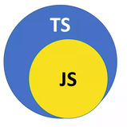
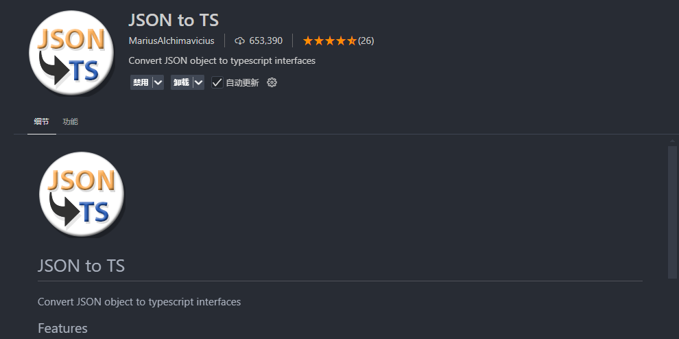
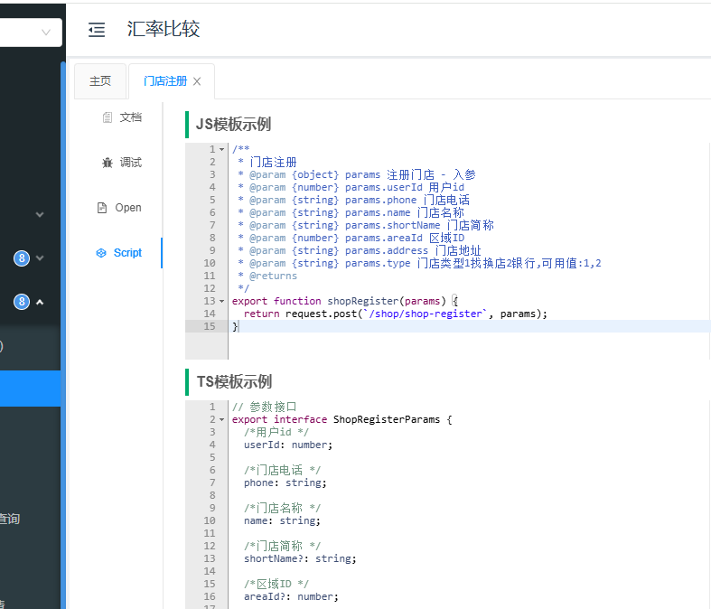

## 概述

`TypeScript`（简称 TS）是微软公司开发的一种基于 `JavaScript` （简称 JS）语言的编程语言。

它的目的并不是创造一种全新语言，而是增强 `JavaScript` 的功能，使其更适合多人合作的企业级项目。

`TypeScript` 可以看成是 `JavaScript` 的超集（`superset`），即它继承了后者的全部语法，所有 `JavaScript` 脚本都可以当作 `TypeScript` 脚本（但是可能会报错），此外它再增加了一些自己的语法。

`TypeScript` 对 `JavaScript` 添加的最主要部分，就是一个独立的类型系统。简单来说就是它包含`js`所有的类型,还有属于自己的新的类型,会在原有的基础上加上类型限制




类型（`type`）指的是一组具有相同特征的值。如果两个值具有某种共同的特征，就可以说，它们属于同一种类型。

举例来说，`123`和`456`这两个值，共同特征是都能进行数值运算，所以都属于“数值”（`number`）这个类型。

一旦确定某个值的类型，就意味着，这个值具有该类型的所有特征，可以进行该类型的所有运算。凡是适用该类型的地方，都可以使用这个值；凡是不适用该类型的地方，使用这个值都会报错。

可以这样理解，**类型是人为添加的一种编程约束和用法提示。** 主要目的是在软件开发过程中，为编译器和开发工具提供更多的验证和帮助，帮助提高代码质量，减少错误。``

```ts
const addCount = (num:number) => {
return count + 1
}
```

上述示例中声明一个 `addCount` 函数 ,调用后返回一个加一之后的数字,限制他传入的数字只能是数字类型,传入其他类型的值就会报错

```ts
addCount('你好')  // 错误
```

上面示例中，函数`addCount()`传入了一个字符串`你好`，`TypeScript` 发现类型不对，就报错了，指出这个位置只能传入数值，不能传入字符串。

`JavaScript` 语言就没有这个功能，不会检查类型对不对。开发阶段很可能发现不了这个问题，代码也许就会原样发布，导致用户在使用时遇到错误。

作为比较，`TypeScript` 是在开发阶段报错，这样有利于提早发现错误，避免使用时报错。另一方面，函数定义里面加入类型，具有提示作用，可以告诉开发者这个函数怎么用。

## 动态类型与静态类型

`TypeScript` 的主要功能是为 `JavaScript` 添加类型系统。大家可能知道，`JavaScript` 语言本身就有一套自己的类型系统，比如数值`123`和字符串`Hello`

但是，`JavaScript` 的类型系统非常弱，而且没有使用限制，运算符可以接受各种类型的值。在语法上，`JavaScript` 属于动态类型语言。

```ts
例一:
let a = "1"
a = 2
例二:
let ikun = {
hobby:()=> {
console.log('我会唱,跳,rap,打篮球')
}
name: 'chicken'
}
delete ikun.name
ikun.name = 'basketball'
```

上面的例一，变量`a`声明时，值的类型是字符串，但是后面可以改成数字。所以，无法提前知道变量的类型是什么，也就是说，变量的类型是动态的。可以随意的改动, 肆无忌惮, 为所欲为

上面的例二，变量`ikun`是一个对象，有一个爱好`hobby`，输出我会唱,跳,rap,打篮球, 有一个名字, `chicken`但是这个属性是可以删掉的，并且还可以新增其他属性。所以，对象有什么属性，这个属性还在不在，也是动态的，没法提前知道。

正是因为存在这些动态变化，所以 JavaScript 的类型系统是动态的，不具有很强的约束性。这对于提前发现代码错误，非常不利。

TypeScript 引入了一个更强大、更严格的类型系统，属于静态类型语言。

上面的代码在 TypeScript 里面都会报错。

```ts
例一:
let a = "1"
a = 2  // 报错
例二:
let ikun = {
hobby:()=> {
console.log('我会唱,跳,rap,打篮球')
}
name: 'chicken'
}
delete ikun.name  // 报错
ikun.name = 'basketball'  //报错
```

上面示例中，例一的报错是因为变量赋值时，`TypeScript` 已经推断确定了类型，后面就不允许再赋值为其他类型的值，即变量的类型是静态的。例二的报错是因为对象的属性也是静态的，不允许随意增删。

`TypeScript` 的作用，就是为 `JavaScript` 引入这种静态类型特征。

## 静态类型的优点

静态类型有很多好处，这也是 TypeScript 想要达到的目的。

（1）有利于代码的静态分析。

有了静态类型，不必运行代码，就可以确定变量的类型，从而推断代码有没有错误。这就叫做代码的静态分析。

这对于大型项目非常重要，单单在开发阶段运行静态检查，就可以发现很多问题，避免交付有问题的代码，大大降低了线上风险。

（2）有利于发现错误。

由于每个值、每个变量、每个运算符都有严格的类型约束，TypeScript 就能轻松发现拼写错误、语义错误和方法调用错误，节省程序员的时间。

```ts
let obj = { message: '' };
console.log(obj.messege); // 报错
```

上面示例中，不小心把`message`拼错了，写成`messege`。TypeScript 就会报错，指出没有定义过这个属性。JavaScript 遇到这种情况是不报错的。

```ts
const a = 0;
const b = true;
const result = a + b; // 报错
```

上面示例是合法的 JavaScript 代码，但是没有意义，不应该将数值`a`与布尔值`b`相加。TypeScript 就会直接报错，提示运算符`+`不能用于数值和布尔值的相加。

```ts
function hello() {
  return 'hello world';
}

hello().find('hello'); // 报错
```

上面示例中，`hello()`返回的是一个字符串，TypeScript 发现字符串没有`find()`方法，所以报错了。如果是 JavaScript，只有到运行阶段才会报错。

（3）更好的 IDE 支持，做到语法提示和自动补全。

IDE（集成开发环境，比如 VSCode）一般都会利用类型信息，提供语法提示功能（编辑器自动提示函数用法、参数等）和自动补全功能（只键入一部分的变量名或函数名，编辑器补全后面的部分）。

（4）提供了代码文档。

类型信息可以部分替代代码文档，解释应该如何使用这些代码，熟练的开发者往往只看类型，就能大致推断代码的作用。借助类型信息，很多工具能够直接生成文档。

（5）有助于代码重构。

修改他人的 JavaScript 代码，往往非常痛苦，项目越大越痛苦，因为不确定修改后是否会影响到其他部分的代码。

类型信息大大减轻了重构的成本。一般来说，只要函数或对象的参数和返回值保持类型不变，就能基本确定，重构后的代码也能正常运行。如果还有配套的单元测试，就完全可以放心重构。越是大型的、多人合作的项目，类型信息能够提供的帮助越大。

综上所述，TypeScript 有助于提高代码质量，保证代码安全，更适合用在大型的企业级项目。这就是为什么大量 JavaScript 项目转成 TypeScript 的原因。

## 静态类型的缺点  

静态类型也存在一些缺点。

（1）丧失了动态类型的代码灵活性。

动态类型有非常高的灵活性，给予程序员很大的自由，静态类型将这些灵活性都剥夺了。

（2）增加了编程工作量。

有了类型之后，程序员不仅需要编写功能，还需要编写类型声明，确保类型正确。这增加了不少工作量，有时会显著拖长项目的开发时间。

（3）更高的学习成本。

类型系统通常比较复杂，要学习的东西更多，要求开发者付出更高的学习成本。

（4）引入了独立的编译步骤。

原生的 JavaScript 代码，可以直接在 JavaScript 引擎运行。添加类型系统以后，就多出了一个单独的编译步骤，检查类型是否正确，并将 TypeScript 代码转成 JavaScript 代码，这样才能运行。

（5）兼容性问题。

TypeScript 依赖 JavaScript 生态，需要用到很多外部模块。但是，过去大部分 JavaScript 项目都没有做 TypeScript 适配，虽然可以自己动手做适配，不过使用时难免还是会有一些兼容性问题。

总的来说，这些缺点使得 TypeScript 不一定适合那些小型的、短期的个人项目。

## 起步安装搭建ts的开发环境

tsc 是一个 npm 模块，使用下面的命令安装（必须先安装 node环境）。

```shell
npm i typescript -g
## pnpm i typescript -g
## yarn add typescript -g
```

TypeScript 官方提供的编译器叫做 tsc，可以将 TypeScript 脚本编译成 JavaScript 脚本。本机想要编译 TypeScript 代码，必须安装 tsc。

根据约定，TypeScript 脚本文件使用`.ts`后缀名，JavaScript 脚本文件使用`.js`后缀名。tsc 的作用就是把`.ts`脚本转变成`.js`脚本。

检测是否安装成功

```bash
# 或者 tsc --version
tsc -v
Version 5.1.6
```

上面命令中，`-v`或`--version`参数可以输出当前安装的 tsc 版本

安装 tsc 之后，就可以编译 TypeScript 脚本了。

`tsc`命令后面，加上 TypeScript 脚本文件，就可以将其编译成 JavaScript 脚本。

```bash
tsc app.ts
```

上面命令会在当前目录下，生成一个`app.js`脚本文件，这个脚本就完全是编译后生成的 JavaScript 代码。

`tsc`命令也可以一次编译多个 TypeScript 脚本。

```bash
tsc file1.ts file2.ts file3.ts
```

上面命令会在当前目录生成三个 JavaScript 脚本文件`file1.js`、`file2.js`、`file3.js`。

tsc 有很多参数，可以调整编译行为。

**（1）--outFile**

如果想将多个 TypeScript 脚本编译成一个 JavaScript 文件，使用`--outFile`参数。

```bash
tsc file1.ts file2.ts --outFile app.js
```

上面命令将`file1.ts`和`file2.ts`两个脚本编译成一个 JavaScript 文件`app.js`。

**（2）--outDir**

编译结果默认都保存在当前目录，`--outDir`参数可以指定保存到其他目录。

```bash
tsc app.ts --outDir dist上面命令会在`dist`子目录下生成`app.js`。
```

**（3）--target**

为了保证编译结果能在各种 JavaScript 引擎运行，tsc 默认会将 TypeScript 代码编译成很低版本的 JavaScript，即3.0版本（以`es3`表示）。这通常不是我们想要的结果。

这时可以使用`--target`参数，指定编译后的 JavaScript 版本。建议使用`es2015`，或者更新版本。

```bash
tsc --target es2015 app.ts
```

**(4)   --watch**

在 tsc 后加上 -w 为 --watch的简写形式它会持续监听这个文件的变化

```bash
tsc -w  index.ts 
再新开一个终端, 使用 node 或是 nodemon 运行这个 index.js 文件   
```

**(6)   --noEmitOnError**

如果希望一旦报错就停止编译，不生成编译产物，可以使用`--noEmitOnError`参数

```bash
 tsc --noEmitOnError app.ts
```

上面命令在报错后，就不会生成`app.js`

**(7)   --noEmit**

只检查类型是否正确，不生成 JavaScript 文件。

```bash
 tsc --noEmit app.ts
```

上面命令只检查是否有编译错误，不会生成`app.js`。

## tsconfig.json

TypeScript 允许将`tsc`的编译参数，写在配置文件`tsconfig.json`。只要当前目录有这个文件，`tsc`就会自动读取，所以运行时可以不写参数

有了这个配置文件，编译时直接调用`tsc`命令就可以了

生成 `tsconfig.json` 配置文件

```ts
tsc --init // 会在根目录下生成一个 tsconfig.js 的配置文件
```

`tsconfig.json`是 TypeScript 项目的配置文件，放在项目的根目录。反过来说，如果一个目录里面有`tsconfig.json`，TypeScript 就认为这是项目的根目录。

如果项目源码是 JavaScript，但是想用 TypeScript 处理，那么配置文件的名字是`jsconfig.json`，它跟`tsconfig`的写法是一样的。

`tsconfig.json`文件主要供`tsc`编译器使用，它的命令行参数`--project`或`-p`可以指定`tsconfig.json`的位置（目录或文件皆可）。

```bash
tsc -p ./dir
```


```json
"compilerOptions": {
  "incremental": true, // TS编译器在第一次编译之后会生成一个存储编译信息的文件，第二次编译会在第一次的基础上进行增量编译，可以提高编译的速度
  "tsBuildInfoFile": "./buildFile", // 增量编译文件的存储位置
  "diagnostics": true, // 打印诊断信息 
  "target": "ES5", // 目标语言的版本
  "module": "CommonJS", // 生成代码的模板标准
  "outFile": "./app.js", // 将多个相互依赖的文件生成一个文件，可以用在AMD模块中，即开启时应设置"module": "AMD",
  "lib": ["DOM", "ES2015", "ScriptHost", "ES2019.Array"], // TS需要引用的库，即声明文件，es5 默认引用dom、es5、scripthost,如需要使用es的高级版本特性，通常都需要配置，如es8的数组新特性需要引入"ES2019.Array",
  "allowJS": true, // 允许编译器编译JS，JSX文件
  "checkJs": true, // 允许在JS文件中报错，通常与allowJS一起使用
  "outDir": "./dist", // 指定输出目录
  "rootDir": "./", // 指定输出文件目录(用于输出)，用于控制输出目录结构
  "declaration": true, // 生成声明文件，开启后会自动生成声明文件
  "declarationDir": "./file", // 指定生成声明文件存放目录
  "emitDeclarationOnly": true, // 只生成声明文件，而不会生成js文件
  "sourceMap": true, // 生成目标文件的sourceMap文件
  "inlineSourceMap": true, // 生成目标文件的inline SourceMap，inline SourceMap会包含在生成的js文件中
  "declarationMap": true, // 为声明文件生成sourceMap
  "typeRoots": [], // 声明文件目录，默认时node_modules/@types
  "types": [], // 加载的声明文件包
  "removeComments":true, // 删除注释 
  "noEmit": true, // 不输出文件,即编译后不会生成任何js文件
  "noEmitOnError": true, // 发送错误时不输出任何文件
  "noEmitHelpers": true, // 不生成helper函数，减小体积，需要额外安装，常配合importHelpers一起使用
  "importHelpers": true, // 通过tslib引入helper函数，文件必须是模块
  "downlevelIteration": true, // 降级遍历器实现，如果目标源是es3/5，那么遍历器会有降级的实现
  "strict": true, // 开启所有严格的类型检查
  "alwaysStrict": true, // 在代码中注入'use strict'
  "noImplicitAny": true, // 不允许隐式的any类型
  "strictNullChecks": true, // 不允许把null、undefined赋值给其他类型的变量
  "strictFunctionTypes": true, // 不允许函数参数双向协变
  "strictPropertyInitialization": true, // 类的实例属性必须初始化
  "strictBindCallApply": true, // 严格的bind/call/apply检查
  "noImplicitThis": true, // 不允许this有隐式的any类型
  "noUnusedLocals": true, // 检查只声明、未使用的局部变量(只提示不报错)
  "noUnusedParameters": true, // 检查未使用的函数参数(只提示不报错)
  "noFallthroughCasesInSwitch": true, // 防止switch语句贯穿(即如果没有break语句后面不会执行)
  "noImplicitReturns": true, //每个分支都会有返回值
  "esModuleInterop": true, // 允许export=导出，由import from 导入
  "allowUmdGlobalAccess": true, // 允许在模块中全局变量的方式访问umd模块
  "moduleResolution": "node", // 模块解析策略，ts默认用node的解析策略，即相对的方式导入
  "baseUrl": "./", // 解析非相对模块的基地址，默认是当前目录
  "paths": { // 路径映射，相对于baseUrl
    // 如使用jq时不想使用默认版本，而需要手动指定版本，可进行如下配置
    "jquery": ["node_modules/jquery/dist/jquery.min.js"]
  },
  "rootDirs": ["src","out"], // 将多个目录放在一个虚拟目录下，用于运行时，即编译后引入文件的位置可能发生变化，这也设置可以虚拟src和out在同一个目录下，不用再去改变路径也不会报错
  "listEmittedFiles": true, // 打印输出文件
  "listFiles": true// 打印编译的文件(包括引用的声明文件)
}
 
// 指定一个匹配列表（属于自动指定该路径下的所有ts相关文件）
"include": [
   "src/**/*"
],
// 指定一个排除列表（include的反向操作）
 "exclude": [
   "demo.ts"
],
// 指定哪些文件使用该配置（属于手动一个个指定文件）
 "files": [
   "demo.ts"
]
```

#### 常用属性

1.include
指定编译文件默认是编译当前目录下所有的ts文件

2.exclude
指定排除的文件

3.target
指定编译js 的版本例如es5  es6

4.allowJS
是否允许编译js文件

5.removeComments
是否在编译过程中删除文件中的注释

6.rootDir
编译文件的目录

7.outDir
输出的目录

8.sourceMap
代码源文件

9.strict
严格模式

10.module
默认common.js  可选es6模式 amd  umd 等

## typescript开发环境搭建

VS Code 本身就是由 TypeScript 编写的，因此它对 TypeScript 有着非常全面的支持，包括类型检查、补全等功能

首先是开发typescript项目的插件

[Typescript Importer](https://marketplace.visualstudio.com/items?itemName=pmneo.tsimporter) 类型自动导入

这一插件会收集你项目内所有的类型定义，在你敲出`:`时提供这些类型来进行补全。如果你选择了一个，它还会自动帮你把这个类型导入进来。效果如图所示：


[Move Ts](https://marketplace.visualstudio.com/items?itemName=stringham.move-ts) 快速移动typescript文件

这一插件在重构以及像我们这样写 demo 的场景下很有帮助。它可以让你通过编辑文件的路径，直接修改项目的目录结构。比如从`home/project/learn-interface.ts` 修改成 `home/project/interface-notes/interface-extend.ts`，这个插件会自动帮你把文件目录更改到对应的样子，并且更新其他文件中对这一文件的导入语句。


JSON to TS 可以将后端的接口文档的 json 文件格式改成 ts 的格式

如果后端的接口文档使用的是 knife4j 搭建的话,里面增强了一些功能,默认是有对应的ts模板的,可以忽略





使用

全部选中文件后, 按下快捷键 `ctrl + shift + alt + s`,全部转换为ts的格式


当然，对于 VS Code 内置的 TypeScript 支持，我们也可以通过一些配置项获得更好的开发体验。首先，你需要通过 Ctrl(Command) + Shift + P 打开命令面板，找到「打开工作区设置」这一项


然后，在打开的设置中输入 typescript，筛选出所有 TypeScript 有关的配置，点击左侧的"TypeScript"，这里才是官方内置的配置。


我们需要做的就是开启一些代码提示功能（hints），我们知道 TS 能够在很多地方进行类型地自动推导，但你往往要把鼠标悬浮在代码上才能看到推导得到的类型，其实我们可以通过配置将这些推导类型显示出来：

在前面配置搜索处，搜索 'typescript Inlay Hints'，展示的配置就都是提示相关的了，推荐开启的有这么几个：

- Function Like Return Types，显示推导得到的函数返回值类型；
- Parameter Names，显示函数入参的名称；
- Parameter Types，显示函数入参的类型；
- Variable Types，显示变量的类型。

以上选项开启后效果如下


依照自己的习惯和需求开启即可

#### 直接运行ts文件   ts-node/ts-node-dev

当然，如果你主要是想执行 TypeScript 文件，就像 `node index.js` 这样快速地验证代码逻辑，这个时候你就需要 [ts-node](https://www.npmjs.com/package/ts-node) 以及 [ts-node-dev](https://www.npmjs.com/package/ts-node-dev) 这一类工具了。它们能直接执行 ts 文件，并且支持监听文件重新执行

```bash
pnpm i ts-node -g
```

然后，在项目中执行以下命令创建 TypeScript 的项目配置文件： tsconfig.json

```bash
npx --package typescript tsc --init
// 如果全局安装了 TypeScript，可以这么做
tsc --init
```

接着，创建一个 TS 文件：

```typescript
console.log("Hello TypeScript");
```

再使用 ts-node 执行：

```bash
ts-node index.ts
```

ts-node 本身并不支持自动地监听文件变更然后重新执行，而这一能力又是某些项目场景下的刚需，如 NodeJs API 的开发。因此，我们需要 [ts-node-dev](https://link.juejin.cn/?target=https%3A%2F%2Fgithub.com%2Fwclr%2Fts-node-dev) 库来实现这一能力。ts-node-dev 基于 [node-dev](https://link.juejin.cn/?target=https%3A%2F%2Fgithub.com%2Ffgnass%2Fnode-dev)（你可以理解一个类似 nodemon 的库，提供监听文件重新执行的能力） 与 [ts-node](https://link.juejin.cn/?target=https%3A%2F%2Fgithub.com%2FTypeStrong%2Fts-node) 实现，并在重启文件进程时共享同一个 TS 编译进程，避免了每次重启时需要重新实例化编译进程等操作。

首先，我们还是在全局安装：

```bash
npm i ts-node-dev -g
```

ts-node-dev 在全局提供了 `tsnd` 这一简写，你可以运行 `tsnd` 来检查安装情况。最常见的使用命令是这样的：

```bash
ts-node-dev --respawn --transpile-only app.ts
```

respawn 选项启用了监听重启的能力，而 transpileOnly 提供了更快的编译速度。你可以查看官方仓库来了解更多选项，但在大部分场景中以上这个命令已经足够了。

## 类型声明

`TypeScript` 代码最明显的特征，就是为 JavaScript 变量加上了类型声明。

```ts
let name:string = 'ikun'
```

上面示例中，变量`name`的后面使用冒号，声明了它的类型为`string`。

类型声明的写法，一律为在标识符后面添加“冒号 + 类型”。函数参数和返回值，也是这样来声明类型。

```typescript
// 例一：
function addCount（num:number）:number {
return num++
}
// 例二:
const toString = (num:number):string => {
    return String(num)
}
```

示例一中的普通函数`addCount`将入参的类型限定为数字类型并加一后返回,同时返回值的类型也是数字类型

示例二的箭头函数中，函数`toString()`的参数`num`的类型是`number`。参数列表的圆括号后面，声明了返回值的类型是`string`

## typescript中的类型

`typescript`是`javascript`的超集,当然包含所有的js里面所有的类型,但是也是有这ts自己的一些独特的类型,比如 `enum` ,`never`, `unknow`等

### 字符串类型

```ts
//普通声明
 let a: string = '123'
//也可以使用es6的字符串模板
let str: string = `dddd${a}`
```

### 数字类型

数字类型是支持，八进制，六进制，十进制，二进制等

```typescript
let notANumber: number = NaN;//Nan
let num: number = 123;//普通数字
let infinityNumber: number = Infinity;//无穷大
let decimal: number = 6;//十进制
let hex: number = 0xf00d;//十六进制
let binary: number = 0b1010;//二进制
let octal: number = 0o744;//八进制s
```

### bigint 类型

bigint 类型包含所有的大整数。

```ts
const x:bigint = 123n;
const y:bigint = 0xffffn;
```

上面示例中，变量`x`和`y`就属于 bigint 类型。

bigint 与 number 类型不兼容。

```ts
const x:bigint = 123; // 报错
const y:bigint = 3.14; // 报错
```

上面示例中，`bigint`类型赋值为整数和小数，都会报错

注意，bigint 类型是 ES2020 标准引入的。如果使用这个类型，TypeScript 编译的目标 JavaScript 版本不能低于 ES2020（即编译参数`target`不低于`es2020`）

### 布尔类型

```ts
let a1:boolean = true
let a2:boolean = false
```

### 空值类型

`JavaScript` 没有空值（Void）的概念，在`TypeScript` 中，可以用 `void` 表示没有任何返回值的函数，只是简单的调用不需要返回值

```ts
function voidFn(): void {
    console.log('test void')
}
```

`void` 类型的用法，主要是用在我们**不希望**调用者关心函数返回值的情况下，比如通常的**异步回调函数**

### null 和 undefined 类型

undefined 和 null 是两种独立类型，它们各自都只有一个值

undefined 类型只包含一个值`undefined`，表示未定义（即还未给出定义，以后可能会有定义）

```ts
let x:undefined = undefined;
```

上面示例中，变量`x`就属于 undefined 类型。两个`undefined`里面，第一个是类型，第二个是值

null 类型也只包含一个值`null`，表示为空（即此处没有值）

```ts
const x:null = null;
```

上面示例中，变量`x`就属于 null 类型

### undefined 和 null 的特殊性

`undefined`和`null`既是值，又是类型 

作为值，它们有一个特殊的地方：任何其他类型的变量都可以赋值为`undefined`或`null`

```ts
let age:number = 24;

age = null;      // 正确
age = undefined; // 正确
```


```ts
const obj:object = undefined;
obj.toString() // 编译不报错，运行就报错
```

上面示例中，变量`obj`等于`undefined`，编译不会报错。但是，实际执行时，调用`obj.toString()`就报错了，因为`undefined`不是对象，没有这个方法。

为了避免这种情况，及早发现错误，TypeScript 提供了一个编译选项`strictNullChecks`。只要打开这个选项，`undefined`和`null`就不能赋值给其他类型的变量（除了`any`类型和`unknown`类型）。

下面是 tsc 命令打开这个编译选项的例子。

```ts
// tsc --strictNullChecks app.ts

let age:number = 24;

age = null;      // 报错
age = undefined; // 报错
```

上面示例中，打开`--strictNullChecks`以后，`number`类型的变量`age`就不能赋值为`undefined`和`null`。

这个选项在配置文件`tsconfig.json`的写法如下。

```ts
{
  "compilerOptions": {
    "strictNullChecks": true
    // ...
  }
}
```

打开`strictNullChecks`以后，`undefined`和`null`这两种值也不能互相赋值了。

```ts
// 打开 strictNullChecks

let x:undefined = null; // 报错
let y:null = undefined; // 报错
```

上面示例中，`undefined`类型的变量赋值为`null`，或者`null`类型的变量赋值为`undefined`，都会报错。

总之，打开`strictNullChecks`以后，`undefined`和`null`只能赋值给自身，或者`any`类型和`unknown`类型的变量。

```ts
let x:any     = undefined;
let y:unknown = null;
```

### **void 和 undefined 和 null 最大的区别**

与 void 的区别是，`undefined` 和 `null` 是所有类型的子类型。也就是说 `undefined` 类型的变量，可以赋值给 `string` 类型的变量：

```ts
//这样写会报错 void类型不可以分给其他类型
let test: void = undefined
let num2: string = "1"

num2 = test
//这样是没问题的
let test: null = null
let num2: string = "1"

num2 = test

//或者这样的
let test: undefined = undefined
let num2: string = "1"

num2 = test
```

### any类型

1.没有强制限定哪种类型，随时切换类型都可以 我们可以对 `any `进行任何操作，不需要检查类型

```ts
let anys:any = 123  // 正确
anys = '123' // 正确
anys = true  // 正确
```

上面示例中，变量`anys`的类型是`any`，就可以被赋值为任意类型的值

变量类型一旦设为`any`，TypeScript 实际上会关闭这个变量的类型检查。即使有明显的类型错误，只要句法正确，都不会报错

2.声明变量的时候没有指定任意类型默认为`any`

```ts
let anys;
anys = '123'
anys = true
```

3.弊端如果使用any 就失去了TS类型检测的作用

```ts
let x:any = 'hello';

x(1) // 不报错
x.foo = 100; // 不报错
```

上面示例中，变量`x`的值是一个字符串，但是把它当作函数调用，或者当作对象读取任意属性，TypeScript 编译时都不报错。原因就是`x`的类型是`any`，TypeScript 不对其进行类型检查

由于这个原因，应该尽量避免使用`any`类型，否则就失去了使用 TypeScript 的意义

实际开发中，`any`类型主要适用以下两个场合

（1）出于特殊原因，需要关闭某些变量的类型检查，就可以把该变量的类型设为`any`

（2）为了适配以前老的 JavaScript 项目，让代码快速迁移到 TypeScript，可以把变量类型设为`any`。有些年代很久的大型 JavaScript 项目，尤其是别人的代码，很难为每一行适配正确的类型，这时你为那些类型复杂的变量加上`any`，TypeScript 编译时就不会报错

总之，TypeScript 认为，只要开发者使用了`any`类型，就表示开发者想要自己来处理这些代码，所以就不对`any`类型进行任何限制，怎么使用都可以

从集合论的角度看，`any`类型可以看成是所有其他类型的全集，包含了一切可能的类型。TypeScript 将这种类型称为“顶层类型”（top type），意为涵盖了所有下层

### 类型推论

ts编译器会自动推论变量的类型

我声明了一个变量但是没有明确指定这个变量的类型，TypeScript会在明确没有指定类型的时候推论出一个类型，这就是类型推论

```ts
let name = '小磊' // string类型
let age = 18 // number类型
...
```

如果你声明了一个变量没有定义类型，也没有赋值这个时候会被推断成any类型，可以进行任何操作

```ts
let username
username = 123
username = '123'
username = true
username = null
...
```

TypeScript 也可以推断函数的返回值。

```ts
function toString(num:number) {
  return String(num);
}
```

上面示例中，函数`toString()`没有声明返回值的类型，但是 TypeScript 推断返回的是字符串。正是因为 TypeScript 的类型推断，所以函数返回值的类型通常是省略不写的。

从这里可以看到，TypeScript 的设计思想是，类型声明是可选的，你可以加，也可以不加。即使不加类型声明，依然是有效的 TypeScript 代码，只是这时不能保证 TypeScript 会正确推断出类型。由于这个原因，所有 JavaScript 代码都是合法的 TypeScript 代码。

这样设计还有一个好处，将以前的 JavaScript 项目改为 TypeScript 项目时，你可以逐步地为老代码添加类型，即使有些代码没有添加，也不会无法运行

### 类型推论问题

对于开发者没有指定类型、TypeScript 必须自己推断类型的那些变量，如果无法推断出类型，TypeScript 就会认为该变量的类型是`any`

```ts
function add(x, y) {
  return x + y;
}

add(1, [1, 2, 3]) // 不报错
```

上面示例中，函数`add()`的参数变量`x`和`y`，都没有足够的信息，TypeScript 无法推断出它们的类型，就会认为这两个变量和函数返回值的类型都是`any`。以至于后面就不再对函数`add()`进行类型检查了，怎么用都可以

这显然是很糟糕的情况，所以对于那些类型不明显的变量，一定要显式声明类型，防止被推断为`any`

TypeScript 提供了一个编译选项`noImplicitAny`，打开该选项，只要推断出`any`类型就会报错

```bash
$ tsc --noImplicitAny app.ts
```

上面命令使用了`noImplicitAny`编译选项进行编译，这时上面的函数`add()`就会报错。

这里有一个特殊情况，即使打开了`noImplicitAny`，使用`let`和`var`命令声明变量，但不赋值也不指定类型，是不会报错的。

```ts
var x; // 不报错
let y; // 不报错
```

上面示例中，变量`x`和`y`声明时没有赋值，也没有指定类型，TypeScript 会推断它们的类型为`any`。这时即使打开了`noImplicitAny`，也不会报错

```ts
let x;

x = 123;
x = { foo: 'hello' };
```

上面示例中，变量`x`的类型推断为`any`，但是不报错，可以顺利通过编译

由于这个原因，建议使用`let`和`var`声明变量时，如果不赋值，就一定要显式声明类型，否则可能存在安全隐患

`const`命令没有这个问题，因为 JavaScript 语言规定`const`声明变量时，必须同时进行初始化（赋值）

```ts
const x; // 报错
```

上面示例中，`const`命令声明的`x`是不能改变值的，声明时必须同时赋值，否则报错，所以它不存在类型推断为`any`的问题

`any`类型除了关闭类型检查，还有一个很大的问题，就是它会“污染”其他变量。它可以赋值给其他任何类型的变量（因为没有类型检查），导致其他变量出错。

```ts
let x:any = 'hello';
let y:number;

y = x; // 不报错

y * 123 // 不报错
y.toFixed() // 不报错
```

上面示例中，变量`x`的类型是`any`，实际的值是一个字符串。变量`y`的类型是`number`，表示这是一个数值变量，但是它被赋值为`x`，这时并不会报错。然后，变量`y`继续进行各种数值运算，TypeScript 也检查不出错误，问题就这样留到运行时才会暴露

污染其他具有正确类型的变量，把错误留到运行时，这就是不宜使用`any`类型的另一个主要原因

### unknown 类型

为了解决`any`类型“污染”其他变量的问题，TypeScript 3.0 引入了[`unknown`类型](https://www.typescriptlang.org/docs/handbook/release-notes/typescript-3-0.html#new-unknown-top-type)。它与`any`含义相同，表示类型不确定，可能是任意类型，但是它的使用有一些限制，不像`any`那样自由，可以视为严格版的`any`。

`unknown`跟`any`的相似之处，在于所有类型的值都可以分配给`unknown`类型。

```ts
let x:unknown;

x = true; // 正确
x = 42; // 正确
x = 'Hello World'; // 正确
```

上面示例中，变量`x`的类型是`unknown`，可以赋值为各种类型的值。这与`any`的行为一致。

`unknown`类型跟`any`类型的不同之处在于，它不能直接使用。主要有以下几个限制。

首先，`unknown`类型的变量，<span style="color: red;">**不能直接赋值给其他类型的变量**</span>（除了`any`类型和`unknown`类型）。

```ts
let v:unknown = 123;

let v1:boolean = v; // 报错
let v2:number = v; // 报错
```

上面示例中，变量`v`是`unknown`类型，赋值给`any`和`unknown`以外类型的变量都会报错，这就避免了污染问题，从而克服了`any`类型的一大缺点。

其次，不能直接调用`unknown`类型变量的方法和属性。

```ts
let v1:unknown = { foo: 123 };
v1.foo  // 报错

let v2:unknown = 'hello';
v2.trim() // 报错

let v3:unknown = (n = 0) => n + 1;
v3() // 报错
```

上面示例中，直接调用`unknown`类型变量的属性和方法，或者直接当作函数执行，都会报错。

再次，`unknown`类型变量能够进行的运算是有限的，只能进行比较运算（运算符`==`、`===`、`!=`、`!==`、`||`、`&&`、`?`）、取反运算（运算符`!`）、`typeof`运算符和`instanceof`运算符这几种，其他运算都会报错。

```ts
let a:unknown = 1;

a + 1 // 报错
a === 1 // 正确
```

上面示例中，`unknown`类型的变量`a`进行加法运算会报错，因为这是不允许的运算。但是，进行比较运算就是可以的。

那么，怎么才能使用`unknown`类型变量呢？

答案是只有经过“类型缩小”，`unknown`类型变量才可以使用。所谓“类型缩小”，就是缩小`unknown`变量的类型范围，确保不会出错。

```ts
let a:unknown = 1;

if (typeof a === 'number') {
  let r = a + 10; // 正确
}
```

上面示例中，`unknown`类型的变量`a`经过`typeof`运算以后，能够确定实际类型是`number`，就能用于加法运算了。这就是“类型缩小”，即将一个不确定的类型缩小为更明确的类型。

下面是另一个例子。

```ts
let s:unknown = 'hello';

if (typeof s === 'string') {
  s.length; // 正确
}
```

上面示例中，确定变量`s`的类型为字符串以后，才能调用它的`length`属性。

这样设计的目的是，只有明确`unknown`变量的实际类型，才允许使用它，防止像`any`那样可以随意乱用，“污染”其他变量。类型缩小以后再使用，就不会报错。

总之，`unknown`可以看作是更安全的`any`。一般来说，凡是需要设为`any`类型的地方，通常都应该优先考虑设为`unknown`类型。

在集合论上，`unknown`也可以视为所有其他类型（除了`any`）的全集，所以它和`any`一样，也属于 TypeScript 的顶层类型。

### never类型

never类型就像它的英文单词的意思一样，它表示的是一个永远不会发生值的类型，不可能存在的一个类型

可能会出现never类型的一些情况

函数抛出异常

如果一个函数抛出异常，那么它的返回值的类型就是never，因为在函数抛出异常后就会直接中断程序的运行，这意味着程序不会继续执行到函数返回语句的那一步

```ts
const throwError = (messge:string)=> {
throw new Error(message)
}
```

不会有返回值的函数

如果一个函数为一个死循环函数，比如while的无限死循环函数，那么该循环的类型就会被推断为never类型

```ts
const loop = () => {
 while(true) {
   console.log('hello,my name is jack')
  }
}
```

never 类型属于底层类型会被忽略，任何类型和never类型的联合类型都是其本身

```ts
type arr = void | number | never  // void | number
```

never类型与任何类型的交叉类型都是never类型

```ts
type a1 = number & never // never
type a2 = string & never // never
type a3 = boolean & never // never
```

never 可以赋值给任何类型

由于 never 类型是所有其他类型的子类型，所以可以将 never 赋值给任何其他类型

```ts
let n:never
let str:string = n
let num:number = n
let b:boolean = n
...
```

其他类型不能赋值给never类型

由于never属于底层类型，没有子类型，所以除了never类型本身，任何类型都不能赋值给never类型

```ts
let n:never
n = 'ikun' // ❌
n = 18 // ❌
n = true // ❌
...
```

### 包装对象类型

#### 概念

JavaScript 的8种类型之中，`undefined`和`null`其实是两个特殊值，`object`属于复合类型，剩下的五种属于原始类型（primitive value），代表最基本的、不可再分的值。

- boolean
- string
- number
- bigint
- symbol

上面这五种原始类型的值，都有对应的包装对象（wrapper object）。所谓“包装对象”，指的是这些值在需要时，会自动产生的对象。

```ts
'hello'.charAt(1) // 'e'
```

上面示例中，字符串`hello`执行了`charAt()`方法。但是，在 JavaScript 语言中，只有对象才有方法，原始类型的值本身没有方法。这行代码之所以可以运行，就是因为在调用方法时，字符串会自动转为包装对象，`charAt()`方法其实是定义在包装对象上。

五种包装对象之中，symbol 类型和 bigint 类型无法直接获取它们的包装对象（即`Symbol()`和`BigInt()`不能作为构造函数使用），但是剩下三种可以。

- `Boolean()`
- `String()`
- `Number()`

以上三个构造函数，执行后可以直接获取某个原始类型值的包装对象。

```ts
const s = new String('hello');
typeof s   // 'object'
s.charAt(1)   // 'e'
```

上面示例中，`s`就是字符串`hello`的包装对象，`typeof`运算符返回`object`，不是`string`，但是本质上它还是字符串，可以使用所有的字符串方法。

注意，`String()`只有当作构造函数使用时（即带有`new`命令调用），才会返回包装对象。如果当作普通函数使用（不带有`new`命令），返回就是一个普通字符串。其他两个构造函数`Number()`和`Boolean()`也是如此。

### 字面量类型

字面量模式的对象类型是无法进行修改赋值操作的，一般会结合联合类型限制只能选择其中的几个

```ts
let a:{ }  // 可以理解为 new Object，创建一个新对象支持所有的类型
let a:{ } = 123
let a:{ } = '123'
let a:{ } = []
let a:{ } = { name:张三 }
// 结合联合类型进行限制
function printText(str:string,alignment:'left'| 'center'|'right') {
    ...
}
printText('hello','left')
printText('hello','middle') // cuo'wu
```

### object与Object类型的区别

大写的Object类型与js中的原型链相关，原型链的顶端就是Object或者是function，也就意味着所有的原始类型，以及对象类型最终都会指向这个Object

在ts中的Object类型就表示包含所有的类型

事实上，除了`undefined`和`null`这两个值不能转为对象，其他任何值都可以赋值给`Object`类型。

```ts
let obj:Object;

obj = undefined; // 报错
obj = null; // 报错
```

上面示例中，`undefined`和`null`赋值给`Object`类型，就会报错。

另外，空对象`{}`是`Object`类型的简写形式，所以使用`Object`时常常用空对象代替。

```ts
let obj:{};
 
obj = true;
obj = 'hi';
obj = 1;
obj = { foo: 123 };
obj = [1, 2];
obj = (a:number) => a + 1;
```

上面示例中，变量`obj`的类型是空对象`{}`，就代表`Object`类型。

显然，无所不包的`Object`类型既不符合直觉，也不方便使用。

小写的object类型表示非原始类型，即可以用字面量表示的对象，只包含对象、数组和函数，常用于泛型约束

```ts
let a1:object = 1  // 错误 属于原始类型
let a2:object = '123'  // 错误 属于原始类型
let a3:object = true  // 错误  属于原始类型
let a4:object = [] // 正确 非原始类型
let a5:object = {}  // 正确  非原始类型
let a6:object = ()=> 123  // 正确  非原始类型
```

大多数时候，我们使用对象类型，只希望包含真正的对象，不希望包含原始类型。所以，建议总是使用小写类型`object`，不使用大写类型`Object`。

注意，无论是大写的`Object`类型，还是小写的`object`类型，都只包含 JavaScript 内置对象原生的属性和方法，用户自定义的属性和方法都不存在于这两个类型之中

### 接口和对象类型

在typescript中，我们定义对象的方式要用关键字interface（接口），我的理解是使用interface来定义一种约束，让数据的结构满足约束的格式。

接口定义变量的命名建议使用大驼峰命名方案

定义方式如下：

```ts
//这样写是会报错的 因为我们在person定义了a，b，但是对象里面缺少b属性
//使用接口约束的时候不能多一个属性也不能少一个属性
//必须与接口保持一致
interface Person {
    b:string,
    a:string
}

const person:Person  = {
    a:"213"
}
//重名 interface 可以合并
interface A{name:string}
interface A{age:number}
const x:A={name:'xx',age:20}
```

### 继承

```ts
interface A{
    name:string
}

interface B extends A{
    age:number
}

let obj:B = {
    age:18,
    name:"string"
}
```

### 类型别名

type 关键字，可以给一个类型定义一个名字，多用于复合类型

#### 定义类型别名

```ts
// 说白了就是给变量后面的类型起一个名字，名字随意，可以简短一点
type username = string
let str:username = '小磊'
```

#### 定义函数别名

```ts
type str = () => string
let str:str  = () => 'anyscript'
```

#### 定义联合类型别名

```ts
type str = string | number
let str1:str = 123
let str2:str = '123'
```

#### 定义值的别名

```ts
type value = 123 | '123' | 456
let value:value = 123 // 变量value的值只能是上面value定义的值
```

#### type与interface的区别

```ts
interface A extends B {
 // interface 可以用 extends 继承属性
}
// 重名 interface 会合并
interface B {

}

type A = string & B  // type 只能使用 & 交叉类型来实现，合到一起
type C = number | string  // 可以使用联合类型
```

#### 到底是使用interface还是type来定义类型?

在typescript官网中的说明是, 在大多数情况下，你可以根据个人喜好进行选择,没有那一种是最好的


### 可选属性 使用`?`操作符

```ts
//可选属性的含义是该属性可以不存在
//所以说这样写也是没问题的
interface Person {
    b?:string,
    a:string
}

const person:Person  = {
    a:"213"
}
```

### 索引类型

索引类型指的不是某一个特定的类型工具，它其实包含三个部分：**索引签名类型**、**索引类型查询**与**索引类型访问**。

这三者都是独立的类型工具。唯一共同点是，**它们都通过索引的形式来进行类型操作**，但索引签名类型是**声明**，后两者则是**读取**。

#### 索引签名类型

索引签名类型主要指的是在接口或类型别名中，通过以下语法来**快速声明一个键值类型一致的类型结构**：

```typescript
interface AllStringTypes {
  [key: string]: string;
}

type AllStringTypes = {
  [key: string]: string;
}
```

这时，即使你还没声明具体的属性，对于这些类型结构的属性访问也将全部被视为 string 类型

```typescript
interface AllStringTypes {
  [key: string]: string;
}

type PropType1 = AllStringTypes['zhangsan']; // string
type PropType2 = AllStringTypes['599']; // string
```

在这个例子中我们声明的键的类型为 string（`[key: string]`），这也意味着在实现这个类型结构的变量中**只能声明字符串类型的键**：

```typescript
interface AllStringTypes {
  [key: string]: string;
}

const foo: AllStringTypes = {
  "linbudu": "599"
}
```

但由于 JavaScript 中，对于 `obj[prop]` 形式的访问会将**数字索引访问转换为字符串索引访问**，也就是说， `obj[599]` 和 `obj['599']` 的效果是一致的。因此，在字符串索引签名类型中我们仍然可以声明数字类型的键。类似的，symbol 类型也是如此：

```typescript
const foo: AllStringTypes = {
  "linbudu": "599",
  599: "zhangsan",
  [Symbol("ddd")]: 'symbol',
}
```

索引签名类型也可以和具体的键值对类型声明并存，但这时这些具体的键值类型也需要符合索引签名类型的声明：

```typescript
interface AllStringTypes {
  // 类型“number”的属性“propA”不能赋给“string”索引类型“boolean”。
  propA: number;
  [key: string]: boolean;
}
```

这里的符合即指子类型，因此自然也包括联合类型：

```typescript
interface StringOrBooleanTypes {
  propA: number;
  propB: boolean;
  [key: string]: number | boolean;
}
```

索引签名类型的一个常见场景是在重构 JavaScript 代码时，为内部属性较多的对象声明一个 any 的索引签名类型，以此来暂时支持**对类型未明确属性的访问**，并在后续一点点补全类型：

```typescript
interface AnyTypeHere {
  [key: string]: any;
}

const foo: AnyTypeHere['zhangsan'] = 'any value';
```


#### 索引类型查询

刚才我们已经提到了索引类型查询，也就是 keyof 操作符。

严谨地说，它可以将对象中的所有键转换为对应字面量类型，然后再组合成联合类型。

注意，**这里并不会将数字类型的键名转换为字符串类型字面量，而是仍然保持为数字类型字面量**。


```typescript
interface Foo {
  zhangsan: 1,
  599: 2
}

type FooKeys = keyof Foo; // "zhangsan" | 599
// 在 VS Code 中悬浮鼠标只能看到 'keyof Foo'
// 看不到其中的实际值，你可以这么做：
type FooKeys = keyof Foo & {}; // "zhangsan" | 599
```

如果觉得不太好理解，我们可以写段伪代码来模拟 **“从键名到联合类型”** 的过程。

```typescript
type FooKeys = Object.keys(Foo).join(" | ");
```

除了应用在已知的对象类型结构上以外，你还可以直接 `keyof any` 来生产一个联合类型，它会由所有可用作对象键值的类型组成：`string | number | symbol`。也就是说，它是由无数字面量类型组成的，由此我们可以知道， **keyof 的产物必定是一个联合类型**。

#### 索引类型访问

在 JavaScript 中我们可以通过 `obj[expression]` 的方式来动态访问一个对象属性（即计算属性），expression 表达式会先被执行，然后使用返回值来访问属性。而 TypeScript 中我们也可以通过类似的方式，只不过这里的 expression 要换成类型

```typescript
interface NumberRecord {
  [key: string]: number;
}

type PropType = NumberRecord[string]; // number
```

这里，我们使用 string 这个类型来访问 NumberRecord。由于其内部声明了数字类型的索引签名，这里访问到的结果即是 number 类型。注意，其访问方式与返回值均是类型。

更直观的例子是通过字面量类型来进行索引类型访问：

```typescript
interface Foo {
  propA: number;
  propB: boolean;
}

type PropAType = Foo['propA']; // number
type PropBType = Foo['propB']; // boolean

```

看起来这里就是普通的值访问，但实际上这里的`'propA'`和`'propB'`都是**字符串字面量类型**，**而不是一个 JavaScript 字符串值**。

索引类型查询的本质其实就是，**通过键的字面量类型（`'propA'`）访问这个键对应的键值类型（`number`）**。

看到这你肯定会想到，上面的 keyof 操作符能一次性获取这个对象所有的键的字面量类型，是否能用在这里？

当然，这可是 TypeScript 啊。

```typescript
interface Foo {
  propA: number;
  propB: boolean;
  propC: string;
}

type PropTypeUnion = Foo[keyof Foo]; // string | number | boolean

```

使用字面量联合类型进行索引类型访问时，其结果就是将联合类型每个分支对应的类型进行访问后的结果，重新组装成联合类型。**索引类型查询、索引类型访问通常会和映射类型一起搭配使用**，前两者负责访问键，而映射类型在其基础上访问键值类型，我们在下面一个部分就会讲到。

注意，在未声明索引签名类型的情况下，我们不能使用 `NumberRecord[string]` 这种原始类型的访问方式，而只能通过键名的字面量类型来进行访问。

```typescript
interface Foo {
  propA: number;
}

// 类型“Foo”没有匹配的类型“string”的索引签名。
type PropAType = Foo[string]; 

```

索引类型的最佳拍档之一就是映射类型，同时映射类型也是类型编程中常用的一个手段

#### 实战案例

当后端返回了一个数据，我只是想要他其中的一部分数据，但是我又不知道其他的数据格式是什么样子的，这个时候就可以使用索引签名来添加一个类型，允许接口的对象里面是可以添加其他的属性的，在上面的字面量`{}`类型中无法添加属性也是可以使用这个方法来进行修改添加

```ts
interface OneType {
name：string
age：number
[propName:string]:any  // 属性名是任意的，它的类型也是任意的，因为我们不知道它的类型到底是什么样子的
}

let a:Onetype = {
name: '小磊'
age：18
gender: 男
}
```

假设有这样一个业务场景，一个页面要用在不同的 APP 里，比如淘宝、天猫、支付宝，根据所在 APP 的不同，调用的底层 API 会不同，我们可能会这样写：

```typescript
const APP = ['TaoBao', 'Tmall', 'Alipay'];

function getPhoto(app: string) {
  // ...
}
  
getPhoto('TaoBao'); // ok
getPhoto('whatever'); // ok
```

如果我们仅仅是对 app 约束为 `string` 类型，即使传入其他的字符串，也不会导致报错，我们可以使用字面量联合类型约束一下：

```typescript
const APP = ['TaoBao', 'Tmall', 'Alipay'];
type app = 'TaoBao' | 'Tmall' | 'Alipay';

function getPhoto(app: app) {
  // ...
}
  
getPhoto('TaoBao'); // ok
getPhoto('whatever'); // not ok
```

但写两遍又有些冗余，我们怎么根据一个数组获取它的所有值的字符串联合类型呢？

我们就可以结合 `typeof` 和本节的内容实现：

```typescript
const APP = ['TaoBao', 'Tmall', 'Alipay'] as const;
type app = typeof APP[number];
// type app = "TaoBao" | "Tmall" | "Alipay"

function getPhoto(app: app) {
  // ...
}
  
getPhoto('TaoBao'); // ok
getPhoto('whatever'); // not ok
```

我们来一步步解析：

首先是使用 `as const` 将数组变为 `readonly` 的元组类型：

```typescript
const APP = ['TaoBao', 'Tmall', 'Alipay'] as const;
// const APP: readonly ["TaoBao", "Tmall", "Alipay"]
```

但此时 `APP` 还是一个值，我们通过 `typeof` 获取 `APP` 的类型：

```typescript
type typeOfAPP = typeof APP;
// type typeOfAPP = readonly ["TaoBao", "Tmall", "Alipay"]
```

最后在通过索引访问类型，获取字符串联合类型：

```typescript
type app = typeof APP[number];
// type app = "TaoBao" | "Tmall" | "Alipay"
```

### 映射类型

有的时候，一个类型需要基于另外一个类型，但是你又不想拷贝一份，这个时候可以考虑使用映射类型。

映射类型建立在索引签名的语法上，我们先回顾下索引签名：

```typescript
// 当你需要提前声明属性的类型时
type OnlyBoolsAndHorses = {
  [key: string]: boolean | Horse;
};
 
const conforms: OnlyBoolsAndHorses = {
  del: true,
  rodney: false,
};
```

而映射类型，就是使用了 `PropertyKeys` 联合类型的泛型，其中 `PropertyKeys` 多是通过 `keyof` 创建，然后循环遍历键名创建一个类型：

```typescript
type OptionsFlags<Type> = {
  [Property in keyof Type]: boolean;
};
```

在这个例子中，`OptionsFlags` 会遍历 `Type` 所有的属性，然后设置为布尔类型。

```typescript
type FeatureFlags = {
  darkMode: () => void;
  newUserProfile: () => void;
};
 
type FeatureOptions = OptionsFlags<FeatureFlags>;
// type FeatureOptions = {
//    darkMode: boolean;
//    newUserProfile: boolean;
// }
```

#### 映射修饰符

在使用映射类型时，有两个额外的修饰符可能会用到，一个是 `readonly`，用于设置属性只读，一个是 `?` ，用于设置属性可选。

你可以通过前缀 `-` 或者 `+` 删除或者添加这些修饰符，如果没有写前缀，相当于使用了 `+` 前缀。

```typescript
// 删除属性中的只读属性
type CreateMutable<Type> = {
  -readonly [Property in keyof Type]: Type[Property];
};
 
type LockedAccount = {
  readonly id: string;
  readonly name: string;
};
 
type UnlockedAccount = CreateMutable<LockedAccount>;

// type UnlockedAccount = {
//    id: string;
//    name: string;
// }
```

```typescript
// 删除属性中的可选属性
type Concrete<Type> = {
  [Property in keyof Type]-?: Type[Property];
};
 
type MaybeUser = {
  id: string;
  name?: string;
  age?: number;
};
 
type User = Concrete<MaybeUser>;
// type User = {
//    id: string;
//    name: string;
//    age: number;
// }
```

####  通过 as 实现键名重新映射

在 TypeScript 4.1 及以后，你可以在映射类型中使用 `as` 语句实现键名重新映射：

```typescript
type MappedTypeWithNewProperties<Type> = {
    [Properties in keyof Type as NewKeyType]: Type[Properties]
}
```

举个例子，你可以利用「[模板字面量类型 (opens new window)](https://www.typescriptlang.org/docs/handbook/2/template-literal-types.html)」，基于之前的属性名创建一个新属性名：

```typescript
type Getters<Type> = {
    [Property in keyof Type as `get${Capitalize<string & Property>}`]: () => Type[Property]
};
 
interface Person {
    name: string;
    age: number;
    location: string;
}
 
type LazyPerson = Getters<Person>;

// type LazyPerson = {
//    getName: () => string;
//    getAge: () => number;
//    getLocation: () => string;
// }
```

你也可以利用条件类型返回一个 `never` 从而过滤掉某些属性:

```typescript
// 移除 kind 属性
type RemoveKindField<Type> = {
    [Property in keyof Type as Exclude<Property, "kind">]: Type[Property]
};
 
interface Circle {
    kind: "circle";
    radius: number;
}
 
type KindlessCircle = RemoveKindField<Circle>;

// type KindlessCircle = {
//    radius: number;
// }
```

你还可以遍历任何联合类型，不仅仅是 `string | number | symbol` 这种联合类型，可以是任何类型的联合：

```typescript
type EventConfig<Events extends { kind: string }> = {
    [E in Events as E["kind"]]: (event: E) => void;
}
 
type SquareEvent = { kind: "square", x: number, y: number };
type CircleEvent = { kind: "circle", radius: number };
 
type Config = EventConfig<SquareEvent | CircleEvent>
// type Config = {
//    square: (event: SquareEvent) => void;
//    circle: (event: CircleEvent) => void;
// }
```


### readonly属性

表示里面的属性是只读的，不允许修改，修改会报错，一般会使用在后端返回的唯一id，或是定义的函数

```typescript
interface User {
  readonly id: number;
  name: string;
}

const user: User = { id: 1, name: 'Alice' };
// user.id = 2; // 报错：无法为只读属性赋值
user.name = 'Bob'; // 可以修改非 readonly 属性
```

#### as const 

确保一个变量被推断为完全不可变的常量类型

```typescript
const user = {
  id: 1,
  name: 'John Doe',
} as const;

// user.id = 2; // 报错：无法修改 `id` 的值
// user.name = 'Jane Doe'; // 报错：无法修改 `name` 的值

```


### rest 参数

`rest` 参数允许你将不定数量的参数传递给函数，并将这些参数作为数组处理

使用 `rest` 参数的语法是通过三个点 `...`

```typescript
function printNames(...names: string[]) {
    names.forEach(name => {
        console.log(name);
    });
}

printNames("Alice", "Bob", "Charlie");
// 输出:
// Alice
// Bob
// Charlie

```

在上面的例子中，`printNames` 函数使用 `rest` 参数来接收任意数量的字符串参数，并将它们作为数组 `names` 处理

#### 与其他参数结合使用

`rest` 参数可以与其他参数结合使用，但必须是函数参数列表中的最后一个参数：

```typescript
function printMessage(message: string, ...names: string[]) {
    console.log(message);
    names.forEach(name => {
        console.log(name);
    });
}

printMessage("Hello everyone", "Alice", "Bob", "Charlie");
// 输出:
// Hello everyone
// Alice
// Bob
// Charlie
```

### 模板字面量类型

它们跟 JavaScript 的模板字符串是相同的语法，但是只能用在类型操作中。当使用模板字面量类型时，它会替换模板中的变量，返回一个新的字符串字面量：

```typescript
type World = "world";
 
type Greeting = `hello ${World}`;
// type Greeting = "hello world"
```

当模板中的变量是一个联合类型时，每一个可能的字符串字面量都会被表示：

```typescript
type EmailLocaleIDs = "welcome_email" | "email_heading";
type FooterLocaleIDs = "footer_title" | "footer_sendoff";
 
type AllLocaleIDs = `${EmailLocaleIDs | FooterLocaleIDs}_id`;
// type AllLocaleIDs = "welcome_email_id" | "email_heading_id" | "footer_title_id" | "footer_sendoff_id"
```

如果模板字面量里的多个变量都是联合类型，结果会交叉相乘，比如下面的例子就有 2 * 2 * 3 一共 12 种结果：

```typescript
type AllLocaleIDs = `${EmailLocaleIDs | FooterLocaleIDs}_id`;
type Lang = "en" | "ja" | "pt";
 
type LocaleMessageIDs = `${Lang}_${AllLocaleIDs}`;
// type LocaleMessageIDs = "en_welcome_email_id" | "en_email_heading_id" | "en_footer_title_id" | "en_footer_sendoff_id" | "ja_welcome_email_id" | "ja_email_heading_id" | "ja_footer_title_id" | "ja_footer_sendoff_id" | "pt_welcome_email_id" | "pt_email_heading_id" | "pt_footer_title_id" | "pt_footer_sendoff_id"
```

如果真的是非常长的字符串联合类型，推荐提前生成，这种还是适用于短一些的情况。

### 数组类型

数组的普通类型

方式1

```ts
let arr:number[] = [1,2,3,4] 
```

方式2，使用泛型表示

```ts
let arr:Array<number> = [1,2,3,4]
```

使用 interface 定义对象数组

```ts
interface Array = {
name：string
age：number
}

let  arr: Array[] = [{name:'小磊'，age：18}，{name: '张三'，age：20}]
```

### 定义二维数组

```ts
let arr:number[][] = [[1],[2]]
//泛型定义
let arr:Array<Array<number>> = [[1],[2],[3]]
```

### 元组类型

它表示成员类型可以自由设置的数组，即数组的各个成员的类型可以不同

由于成员的类型可以不一样，所以元组必须明确声明每个成员的类型

```ts
let arr:[number,string,boolean,null] = [1,'123',true,null]
```

数组的成员类型写在方括号外面（`number[]`），元组的成员类型是写在方括号里面（`[number]`）。TypeScript 的区分方法就是，成员类型写在方括号里面的就是元组，写在外面的就是数组

```ts
数组
const arr:string[] = [1]
元组
const t = [number] = [2]
```

元组成员的类型可以添加问号后缀（`?`），表示该成员是可选的。

```ts
let a:[number, number?] = [1];
```

上面示例中，元组`a`的第二个成员是可选的，可以省略。

注意，问号只能用于元组的尾部成员，也就是说，所有可选成员必须在必选成员之后。

```ts
type myTuple = [
  number,
  number,
  number?,
  string?
];
```

上面示例中，元组`myTuple`的最后两个成员是可选的。也就是说，它的成员数量可能有两个、三个和四个

由于必须要单独声明每个元组成员的类型，所以元组成员的个数是有限的，当访问越界的时候就会出现报错

```ts
let x:[string, string] = ['a', 'b'];

x[2] = 'c'; // 报错
```

使用扩展运算符（`...`），可以表示不限成员数量的元组

```ts
type NamedNums = [
  string,
  ...number[]
];

const a:NamedNums = ['A', 1, 2];
const b:NamedNums = ['B', 1, 2, 3];
```

元组类型`NamedNums`的第一个成员是字符串，后面的成员使用扩展运算符来展开一个数组，从而实现了不定数量的成员

如果不确定元组成员的类型和数量，可以写成下面这样。

```ts
type Tuple = [...any[]];
```

上面示例中，元组`Tuple`可以放置任意数量和类型的成员。但是这样写，也就失去了使用元组和 TypeScript 的意义

元组可以通过方括号，读取成员类型。

```ts
type Tuple = [string, number];
type Age = Tuple[1]; // number
```

### 函数类型定义

```ts
// 在函数的参数后面写类型，括号后面写函数对应的返回值
// 普通函数
function sum(a:number,b:number):number {
return a+b
}
// 箭头函数
// 使用 = 为参数设置默认值
// 使用 ？可设置可选参数，且必须在最后一位参数
const add(a:number,b:number = 1):number => a + b
```

如果一个变量要套用另一个函数类型，有一个小技巧，就是使用`typeof`运算符。

```ts
function add(
  x:number,
  y:number
) {
  return x + y;
}

const myAdd:typeof add = function (x, y) {
  return x + y;
}
```

上面示例中，函数`myAdd()`的类型与函数`add()`是一样的，那么就可以定义成`typeof add`。因为函数名`add`本身不是类型，而是一个值，所以要用`typeof`运算符返回它的类型。

### 函数调用签名

```typescript
//函数类型表达式

type Add = (x: number, y: number) => number

// 这里的 addNumber 就是一个函数类型表达式,类型是 Add 是一个函数类型*

const addNumber: Add = (a, b) => a + b

// 函数调用签名

// 在JavaScript中函数除了可以被调用, 也是可以有自己的属性的 , 比如 length, name 等等, 但是在TypeScript中函数除了可以被调用, 还可以有自己的类型, 这个类型就是函数调用签名

// 函数调用签名用来描述一个函数如何被调用, 也就是函数的参数列表和返回值类型

// 函数调用签名语法

// (参数列表): 返回值类型

interface AddFunc {
 (x: number, y: number): number
 name: string
 type: string
}
```

### 联合类型

联合类型（union types）指的是多个类型组成的一个新类型，使用符号`|`表示，小飞棍来喽！

联合类型`A|B`表示，任何一个类型只要属于`A`或`B`，就属于联合类型`A|B`，条件就是只要是满足其中一个条件就可以

```ts
let phone:string | number = 123456 // 变量的类型同时支持字符串和数字
```

联合类型常常会和值类型一起使用，表示一个变量的值有若干种可能

```ts
let setting:true|false;

let gender:'male'|'female';

let rainbowColor:'赤'|'橙'|'黄'|'绿'|'青'|'蓝'|'紫';
```

我们有时在package.json文件配置时，输入后自动出现下拉选项就是这样实现的


联合类型的第一个成员前面，也可以加上竖杠`|`，这样便于多行书写。

```ts
let x:
  | 'one'
  | 'two'
  | 'three'
  | 'four';
```

如果一个变量有多种类型，读取该变量时，往往需要进行“类型缩小”（type narrowing），区分该值到底属于哪一种类型，然后再进一步处理。

```ts
function printId(
  id:number|string
) {
    console.log(id.toUpperCase()); // 报错
}
```

上面示例中，参数变量`id`可能是数值，也可能是字符串，这时直接对这个变量调用`toUpperCase()`方法会报错，因为这个方法只存在于字符串，不存在于数值。

解决方法就是对参数`id`做一下类型缩小，确定它的类型以后再进行处理。

```ts
function printId(
  id:number|string
) {
  if (typeof id === 'string') {
    console.log(id.toUpperCase());
  } else {
    console.log(id);
  }
}
```

上面示例中，函数体内部会判断一下变量`id`的类型，如果是字符串，就对其执行`toUpperCase()`方法。

“类型缩小”是 TypeScript 处理联合类型的标准方法，凡是遇到可能为多种类型的场合，都需要先缩小类型，再进行处理。实际上，联合类型本身可以看成是一种“类型放大”（type widening），处理时就需要“类型缩小”（type narrowing）

### 交叉类型

交叉类型（intersection types）指的多个类型组成的一个新类型，使用符号`&`表示。

交叉类型`A&B`表示，任何一个类型必须同时属于`A`和`B`，才属于交叉类型`A&B`，即交叉类型同时满足`A`和`B`的特征。

```ts
let x:number&string;
```

上面示例中，变量`x`同时是数值和字符串，这当然是不可能的，所以 TypeScript 会认为`x`的类型实际是`never`。

就像是一个人的性别不可能同时满足男和女一样

交叉类型的主要用途是表示对象的合成。


简来来说就是往一个对象中添加新的属性

```ts
interface People {
name:string
age: number
}

interface Man {
gender:string
}

const lei = (person:People & Man):void => {
console.log(lei({name: '小磊',age: 18,gerder: '男'})) // 相当于 extend 继承，需要填写 gender 属性
}

```

### 类型断言(asserts)

对于在开发中没有进行类型声明的时候,typescript会帮我们进行类型推论,但是有的时候得到的结果可能过于宽泛或者是不是我们想要的

TypeScript 提供了“类型断言”这样一种手段，允许开发者在代码中“断言”某个值的类型，告诉编译器此处的值是什么类型。TypeScript 一旦发现存在类型断言，就不再对该值进行类型推断，而是直接采用断言给出的类型

这种做法的实质是，允许开发者在某个位置“绕过”编译器的类型推断，让本来通不过类型检查的代码能够通过，避免编译器报错。这样虽然削弱了 TypeScript 类型系统的严格性，但是为开发者带来了方便，毕竟开发者比编译器更了解自己的代码

举个例子，如果你使用 `document.getElementById`，TypeScript 仅仅知道它会返回一个 `HTMLElement`，但是你却知道，你要获取的是一个 `HTMLCanvasElement`

这时，你可以使用类型断言将其指定为一个更具体的类型

```typescript
const myCanvas = document.getElementById("main_canvas") as HTMLCanvasElement;
```

就像类型注解一样，类型断言也会被编译器移除，并且不会影响任何运行时的行为

类型断言有两种语法

```typescript
// 语法一：<类型>值
<Type>value

// 语法二：值 as 类型
value as Type
```

上面两种语法是等价的，`value`表示值，`Type`表示类型。

早期只有语法一，后来因为 TypeScript 开始支持 React 的 JSX和TSX 语法（尖括号表示 HTML 元素），为了避免两者冲突，就引入了语法二。

目前，推荐使用语法二。

```ts
let fn = (number:number | string):void=> {
    console.log((number as string).length)
}
fn('1234') // 4
fn(12345)  // 在执行调用的时候并不会给予报错提示，类型断言可以欺骗编译器，无法避免运行时的错误，谨慎使用
```

总之，类型断言并不是真的改变一个值的类型，而是提示编译器，应该如何处理这个值。

#### 类型断言的条件

​	类型断言并不意味着，可以把某个值断言为任意类型

```typescript
const n = 1;
const m:string = n as string; // 报错
```

上面示例中，变量`n`是数值，无法把它断言成字符串，TypeScript 会报错。

类型断言的使用前提是，值的实际类型与断言的类型必须满足一个条件。

```typescript
expr as T
```

上面代码中，`expr`是实际的值，`T`是类型断言，它们必须满足下面的条件：`expr`是`T`的子类型，或者`T`是`expr`的子类型。

也就是说，类型断言要求实际的类型与断言的类型兼容，实际类型可以断言为一个更加宽泛的类型（父类型），也可以断言为一个更加精确的类型（子类型），但不能断言为一个完全无关的类型。

但是，如果真的要断言成一个完全无关的类型，也是可以做到的。

#### 双重断言

如果在使用类型断言时，原类型与断言类型之间差异过大，也就是指鹿为马太过离谱，离谱到了指鹿为霸王龙的程度，TypeScript 会给你一个类型报错

这是因为你的断言类型和原类型的差异太大，需要先断言到一个通用的类，即 any / unknown。

这一通用类型包含了所有可能的类型，因此**断言到它**和**从它断言到另一个类型**差异不大。

```typescript
expr as unknown as T
```

#### 非空断言

这是`typescript`的一种特殊语法，可以在不进行任何显式检查的情况下从类型中删除 `null` 和 `undefined`，在一个表达式之后填上 `！` ，表示我断定这个值一定不是`null`或是`undefined`，你不要给我多管闲事了

```ts
function liveDangerously(x?: number | null) {
  // No error
  console.log(x!.toFixed());
}
```

### typeof 运算

在js中typeof 用来判断一个数据类型是否属于基本数据类型，并返回对应的操作数的类型的一个字符串

```ts
const a = 1
console.log(typeof a) // 'number'
```

使用 `typeof` 检测变量 a 返回的是 number，表示 a 的数据类型为数字

JavaScript 里面，`typeof`运算符只可能返回八种结果，而且都是字符串。

```ts
typeof undefined; // "undefined"
typeof true; // "boolean"
typeof 1337; // "number"
typeof "foo"; // "string"
typeof {}; // "object"
typeof parseInt; // "function"
typeof Symbol(); // "symbol"
typeof 127n // "bigint"
```

而在 `typescript` 中 `typeof` 返回的不是一个字符串，而是该值对应的 `typescript` 类型

```ts
const a = { x: 0 };

type T0 = typeof a;   // { x: number }
type T1 = typeof a.x; // number
```

`typeof a`表示返回变量`a`的 TypeScript 类型（`{ x: number }`）。同理，`typeof a.x`返回的是属性`x`的类型（`number`）

也就是说，同一段代码可能存在两种`typeof`运算符，一种用在值相关的 JavaScript 代码部分，另一种用在类型相关的 TypeScript 代码部分。

```ts
let a = 1;
let b:typeof a;

if (typeof a === 'number') {
  b = a;
}
```

上面示例中，用到了两个`typeof`，第一个是类型运算，第二个是值运算。它们是不一样的，不要混淆。

JavaScript 的 typeof 遵守 JavaScript 规则，TypeScript 的 typeof 遵守 TypeScript 规则。它们的一个重要区别在于，编译后，前者会保留，后者会被全部删除。

### keyof 运算符

keyof 运算符可以取出 Enum 结构的所有成员名，作为联合类型返回

```ts
enum MyEnum {
  A = 'a',
  B = 'b'
}

// 'A'|'B'
type Foo = keyof typeof MyEnum;
```

如果要返回 Enum 所有的成员值，可以使用in运算符

```ts
enum MyEnum {
  A = 'a',
  B = 'b'
}

// { a: any, b: any }
type Foo = { [key in MyEnum]: any };
```


### 内置对象

ECMAscript内置对象

- Boolean 
- Number 
- String 
- RegExp 
- Error
- Date 

```ts
let b: Boolean = new Boolean(1)
console.log(b)
let n: Number = new Number(true)
console.log(n)
let s: String = new String('早上吃的胡辣汤')
console.log(s)
let d: Date = new Date()
console.log(d)
let r: RegExp = /^1{6}$/
console.log(r)
let e: Error = new Error("error!")
console.log(e)
```

Dom和Bom内置对象

- Document
- HTMLElement
- Event
- NodeList 等

```ts
let body: HTMLElement = document.body;
let allDiv: NodeList = document.querySelectorAll('div');
//读取div 这种需要类型断言 或者加个判断应为读不到返回null
let div:HTMLElement = document.querySelector('div') as HTMLDivElement
document.addEventListener('click', function (e: MouseEvent) {
    console.log(e)
});
```

### 内置类型工具

TypeScript 提供了一些内置的类型工具，这些类型处于性能的考虑被内置在编译器中，你不能在 `.d.ts` 文件里找到它们。

#### Awaited<Type>

`Awaited<Type>`用来取出 Promise 的返回值类型，适合用在描述`then()`方法和 await 命令的参数类型。

```typescript
// string
type A = Awaited<Promise<string>>;
```

上面示例中，`Awaited<Type>`会返回 Promise 的返回值类型（string）。

它也可以返回多重 Promise 的返回值类型。

```typescript
// number
type B = Awaited<Promise<Promise<number>>>;
```

如果它的类型参数不是 Promise 类型，那么就会原样返回。

```typescript
// number | boolean
type C = Awaited<boolean | Promise<number>>;
```

上面示例中，类型参数是一个联合类型，其中的`boolean`会原样返回，所以最终返回的是`number|boolean`

#### ConstructorParameters<Type>

`ConstructorParameters<Type>`提取构造方法`Type`的参数类型，组成一个元组类型返回。

```typescript
type T1 = ConstructorParameters<
  new (x: string, y: number) => object
>; // [x: string, y: number]

type T2 = ConstructorParameters<
  new (x?: string) => object
>; // [x?: string | undefined]
```

它可以返回一些内置构造方法的参数类型。

```typescript
type T1 = ConstructorParameters<
  ErrorConstructor
>; // [message?: string]

type T2 = ConstructorParameters<
  FunctionConstructor
>; // string[]

type T3 = ConstructorParameters<
  RegExpConstructor
>; // [pattern:string|RegExp, flags?:string]
```

如果参数类型不是构造方法，就会报错。

```typescript
type T1 = ConstructorParameters<string>; // 报错

type T2 = ConstructorParameters<Function>; // 报错
```

`any`类型和`never`类型是两个特殊值，分别返回`unknown[]`和`never`。

```typescript
type T1 = ConstructorParameters<any>;  // unknown[]

type T2 = ConstructorParameters<never>; // never
```


#### Exclude<UnionType, ExcludedMembers>

`Exclude<UnionType, ExcludedMembers>`用来从联合类型`UnionType`里面，删除某些类型`ExcludedMembers`，组成一个新的类型返回。

```typescript
type T1 = Exclude<'a'|'b'|'c', 'a'>; // 'b'|'c'
type T2 = Exclude<'a'|'b'|'c', 'a'|'b'>; // 'c'
type T3 = Exclude<string|(() => void), Function>; // string
type T4 = Exclude<string | string[], any[]>; // string
type T5 = Exclude<(() => void) | null, Function>; // null
type T6 = Exclude<200 | 400, 200 | 201>; // 400
type T7 = Exclude<number, boolean>; // number
```

#### Extract<Type, Union>

`Extract<UnionType, Union>`用来从联合类型`UnionType`之中，提取指定类型`Union`，组成一个新类型返回。它与`Exclude<T, U>`正好相反。

```typescript
type T1 = Extract<'a'|'b'|'c', 'a'>; // 'a'
type T2 = Extract<'a'|'b'|'c', 'a'|'b'>; // 'a'|'b'
type T3 = Extract<'a'|'b'|'c', 'a'|'d'>; // 'a'
type T4 = Extract<string | string[], any[]>; // string[]
type T5 = Extract<(() => void) | null, Function>; // () => void
type T6 = Extract<200 | 400, 200 | 201>; // 200
```

如果参数类型`Union`不包含在联合类型`UnionType`之中，则返回`never`类型。

```typescript
type T = Extract<string|number, boolean>; // never
```

#### NonNullable<Type>

`NonNullable<Type>`用来从联合类型`Type`删除`null`类型和`undefined`类型，组成一个新类型返回，也就是返回`Type`的非空类型版本。

```typescript
// string|number
type T1 = NonNullable<string|number|undefined>;

// string[]
type T2 = NonNullable<string[]|null|undefined>;

type T3 = NonNullable<boolean>; // boolean
type T4 = NonNullable<number|null>; // number
type T5 = NonNullable<string|undefined>; // string
type T6 = NonNullable<null|undefined>; // never
```


#### Omit<Type, Keys>

`Omit<Type, Keys>`用来从对象类型`Type`中，删除指定的属性`Keys`，组成一个新的对象类型返回。

```typescript
interface A {
  x: number;
  y: number;
}

type T1 = Omit<A, 'x'>;       // { y: number }
type T2 = Omit<A, 'y'>;       // { x: number }
type T3 = Omit<A, 'x' | 'y'>; // { }
```

上面示例中，`Omit<Type, Keys>`从对象类型`A`里面删除指定属性，返回剩下的属性。

指定删除的键名`Keys`可以是对象类型`Type`中不存在的属性，但必须兼容`string|number|symbol`。

```typescript
interface A {
  x: number;
  y: number;
}

type T = Omit<A, 'z'>; // { x: number; y: number }
```

上面示例中，对象类型`A`中不存在属性`z`，所以就原样返回了。

#### Parameters<Type>

`Parameters<Type>`从函数类型`Type`里面提取参数类型，组成一个元组返回。

```typescript
type T1 = Parameters<() => string>; // []

type T2 = Parameters<(s:string) => void>; // [s:string]

type T3 = Parameters<<T>(arg: T) => T>;    // [arg: unknown]

type T4 = Parameters<
  (x:{ a: number; b: string }) => void
>; // [x: { a: number, b: string }]

type T5 = Parameters<
  (a:number, b:number) => number
>; // [a:number, b:number]
```

上面示例中，`Parameters<Type>`的返回值会包括函数的参数名，这一点需要注意。

如果参数类型`Type`不是带有参数的函数形式，会报错。

```typescript
// 报错
type T1 = Parameters<string>;

// 报错
type T2 = Parameters<Function>;
```

由于`any`和`never`是两个特殊值，会返回`unknown[]`和`never`。

```typescript
type T1 = Parameters<any>; // unknown[]

type T2 = Parameters<never>; // never
```

`Parameters<Type>`主要用于从外部模块提供的函数类型中，获取参数类型。

```typescript
interface SecretName {
  first: string;
  last: string;
}

interface SecretSanta {
  name: SecretName;
  gift: string;
}

export function getGift(
  name: SecretName,
  gift: string
): SecretSanta {
 // ...
}
```

上面示例中，模块只输出了函数`getGift()`，没有输出参数`SecretName`和返回值`SecretSanta`。这时就可以通过`Parameters<T>`和`ReturnType<T>`拿到这两个接口类型。

```typescript
type ParaT = Parameters<typeof getGift>[0]; // SecretName

type ReturnT = ReturnType<typeof getGift>; // SecretSanta
```

#### Partial<Type>

`Partial<Type>`返回一个新类型，将参数类型`Type`的所有属性变为可选属性。

```typescript
interface A {
  x: number;
  y: number;
}
 
type T = Partial<A>; // { x?: number; y?: number; }
```


#### Pick<Type, Keys>

`Pick<Type, Keys>`返回一个新的对象类型，第一个参数`Type`是一个对象类型，第二个参数`Keys`是`Type`里面被选定的键名。

```typescript
interface A {
  x: number;
  y: number;
}

type T1 = Pick<A, 'x'>; // { x: number }
type T2 = Pick<A, 'y'>; // { y: number }
type T3 = Pick<A, 'x'|'y'>;  // { x: number; y: number }
```

上面示例中，`Pick<Type, Keys>`会从对象类型`A`里面挑出指定的键名，组成一个新的对象类型。

指定的键名`Keys`必须是对象键名`Type`里面已经存在的键名，否则会报错。

```typescript
interface A {
  x: number;
  y: number;
}

type T = Pick<A, 'z'>; // 报错
```

上面示例中，对象类型`A`不存在键名`z`，所以报错了。

#### Readonly<Type>

`Readonly<Type>`返回一个新类型，将参数类型`Type`的所有属性变为只读属性。

```typescript
interface A {
  x: number;
  y?: number;
}

// { readonly x: number; readonly y?: number; }
type T = Readonly<A>;
```

上面示例中，`y`是可选属性，`Readonly<Type>`不会改变这一点，只会让`y`变成只读

#### Record<Keys, Type>

用于构造一个对象类型，其键（Key）和值（Value）的类型由开发者显式定义。它的核心作用是快速定义键值对的类型约束
基本用法
```ts
type Record<K extends keyof any, T> = {
  [P in K]: T;
};
```
- K: 键的类型，必须是 string、number 或 symbol 的子类型（即合法对象键的类型）。

- T: 值的类型，可以是任意类型（包括基本类型、对象、函数等）

K的类型是继承自type of 返回的 string | number | symbol 的联合类型

作用：

#### **(1) 替代手动定义索引签名**

假设你想定义一个对象，键是字符串，值是数字，通常需要手动写索引签名：

```ts
type MyObj = {
  [key: string]: number;
};
```

使用 `Record` 可以更简洁：

```ts
type MyObj = Record<string, number>;
```

#### **(2) 约束键的联合类型**

当键是明确的联合类型时，`Record` 会强制所有键都必须存在，并统一值的类型：

```ts
type Keys = "name" | "age" | "email";
type Person = Record<Keys, string>;

// 等价于：
type Person = {
  name: string;
  age: string;
  email: string;
};
```

如果缺少任何一个键，TypeScript 会报错：

```ts
const person: Person = {
  name: "Alice",
  age: "30",       // ✅
  // ❌ 缺少 email
};
```

#### **(3) 动态生成映射类型**

结合其他工具类型（如 `Partial`、`Readonly`），可以快速生成复杂类型

```ts
type OptionalPerson = Partial<Record<Keys, string>>;

// 等价于：
type OptionalPerson = {
  name?: string;
  age?: string;
  email?: string;
};
```


#### Required<Type>

`Required<Type>`返回一个新类型，将参数类型`Type`的所有属性变为必选属性。它与`Partial<Type>`的作用正好相反。

```typescript
interface A {
  x?: number;
  y: number;
}

type T = Required<A>; // { x: number; y: number; }
```

#### ReadonlyArray<Type>

`ReadonlyArray<Type>`用来生成一个只读数组类型，类型参数`Type`表示数组成员的类型。

```typescript
const values: ReadonlyArray<string> 
  = ['a', 'b', 'c'];

values[0] = 'x'; // 报错
values.push('x'); // 报错
values.pop(); // 报错
values.splice(1, 1); // 报错

```

上面示例中，变量`values`的类型是一个只读数组，所以修改成员会报错，并且那些会修改源数组的方法`push()`、`pop()`、`splice()`等都不存在。

#### ReturnType<Type>

`ReturnType<Type>`提取函数类型`Type`的返回值类型，作为一个新类型返回。

```typescript
type T1 = ReturnType<() => string>; // string

type T2 = ReturnType<() => {
  a: string; b: number
}>; // { a: string; b: number }

type T3 = ReturnType<(s:string) => void>; // void

type T4 = ReturnType<() => () => any[]>; // () => any[]

type T5 = ReturnType<typeof Math.random>; // number

type T6 = ReturnType<typeof Array.isArray>; // boolean
```

如果参数类型是泛型函数，返回值取决于泛型类型。如果泛型不带有限制条件，就会返回`unknown`。

```typescript
type T1 = ReturnType<<T>() => T>; // unknown

type T2 = ReturnType<
  <T extends U, U extends number[]>() => T
>; // number[]
```

如果类型不是函数，会报错。

```typescript
type T1 = ReturnType<boolean>; // 报错

type T2 = ReturnType<Function>; // 报错
```

`any`和`never`是两个特殊值，分别返回`any`和`never`。

```typescript
type T1 = ReturnType<any>; // any

type T2 = ReturnType<never>; // never
```


#### 字符串类型工具

#### Uppercase

把每个字符转为大写形式：

```typescript
type Greeting = "Hello, world"
type ShoutyGreeting = Uppercase<Greeting>        
// type ShoutyGreeting = "HELLO, WORLD"
 
type ASCIICacheKey<Str extends string> = `ID-${Uppercase<Str>}`
type MainID = ASCIICacheKey<"my_app">
// type MainID = "ID-MY_APP"
```

#### Lowercase

把每个字符转为小写形式：

```typescript
type Greeting = "Hello, world"
type QuietGreeting = Lowercase<Greeting>       
// type QuietGreeting = "hello, world"
 
type ASCIICacheKey<Str extends string> = `id-${Lowercase<Str>}`
type MainID = ASCIICacheKey<"MY_APP">    
// type MainID = "id-my_app"
```

#### Capitalize

把字符串的第一个字符转为大写形式：

```typescript
type LowercaseGreeting = "hello, world";
type Greeting = Capitalize<LowercaseGreeting>;
// type Greeting = "Hello, world"
```

#### Unpitalize

把字符串的第一个字符转换为小写形式：

```typescript
type UppercaseGreeting = "HELLO WORLD";
type UncomfortableGreeting = Uncapitalize<UppercaseGreeting>;           
// type UncomfortableGreeting = "hELLO WORLD"
```


### 枚举类型

枚举类型我的个人理解就是为类型起了一个名字，它对应这一个指定的数字或是字符串，在声明是就必须满足我们规定的类型，尽管我们也是可以手动来进行类型限定的，但是枚举类型的使用可以让我们给成员赋予有意义的名字，使得代码更加易读和理解

#### 数字枚举

例如红绿蓝，red=0，green=1，blue=2，分别代表红色为0，绿色为1，蓝色为2

```ts
enmu Types {
red,
green,
blue
}
```


```ts
enmu Types {
red = 0,
green = 1,
blue = 2
}
// 默认数字从 0 开始，可以不写
```

增长枚举

```ts
enmu Types {
red = 2,
green,
blue
}
// 定义了一个数字枚举，并将 red 初始化为 2，其余成员会从 2 开始自动增长
```

#### 字符串枚举

在一个字符串枚举里面，每一个成员都必须是字符串面量

```ts
enmu Types {
red = 'red',
green = 'green',
blue = 'blue'
}
```

由于字符串枚举没有自增长行为，字符串枚举可以很好的序列化。话句话说，如果你正在调试并且必须要读一个数字枚举时运行的值，这个值通常是很难读的，它并不能表达有用的消息，字符串枚举允许你提供一个运行时有意义的并且可读的值，独立于枚举成员的名字。

#### 异构枚举

混合字符串和数字成员

```ts
enum type {
no:'no'
yes: 1
}
```

#### 接口枚举

定义一个枚举Types 定义一个接口A 他有一个属性red 值为Types.yyds，在声明这个对象的时候要遵守这个规则

```ts
enum Types {
yyds,
ddd
}

interfaces A {
red:Types.yyds
}

let obj:A = {
red:Type.yyds
}
```

#### 同名 enmu 合并

多个同名的 Enum 结构会自动合并。

```ts
enum Foo {
  A,
}

enum Foo {
  B = 1,
}

enum Foo {
  C = 2,
}

// 等同于
enum Foo {
  A,
  B = 1，
  C = 2
}
```

同名 Enum 合并时，不能有同名成员，否则报错。

```ts
enum Foo {
  A,
  B
}

enum Foo {
  B = 1, // 报错
  C
}
```

#### const枚举（常量枚举）

const 声明的枚举会被编译成常量

普通声明的枚举编译完后是个对象

```ts
const enmu Types {
red = 0,
green = 1,
blue = 2
}
```


### 类型守卫

类型缩小的英文是Type Narrowing (也有人翻译为类型守卫或是类型收窄)

类型缩小是指在某个条件下，将一个类型缩小为更具体的类型

类型缩小的常见方式有：

#### 真值收窄

在 JavaScript 中，我们可以在条件语句中使用任何表达式，比如 `&&` 、`||`、`!` 等，举个例子，像 `if` 语句就不需要条件的结果总是 `boolean` 类型

```typescript
function getUsersOnlineMessage(numUsersOnline: number) {
  if (numUsersOnline) {
    return `There are ${numUsersOnline} online now!`;
  }
  return "Nobody's here. :(";
}
```

这是因为 JavaScript 会做隐式类型转换，像 `0` 、`NaN`、`""`、`0n`、`null` `undefined` 这些值都会被转为 `false`，其他的值则会被转为 `true`。

当然你也可以使用 `Boolean` 函数强制转为 `boolean` 值，或者使用更加简短的`!!`：

```typescript
// 这两种方式都会返回 'true'
Boolean("hello"); // 类型: boolean, 值: true
!!"world"; // 类型: boolean, 值: true
```

这种使用方式非常流行，尤其适用于防范 `null`和 `undefiend` 这种值的时候。举个例子，我们可以在 `printAll` 函数中这样使用：

```typescript
function printAll(strs: string | string[] | null) {
  if (strs && typeof strs === "object") {
    for (const s of strs) {
      console.log(s);
    }
  } else if (typeof strs === "string") {
    console.log(strs);
  }
}
```

可以看到通过这种方式，成功的去除了错误。

但还是要注意，在基本类型上的真值检查很容易导致错误，比如，如果我们这样写 `printAll` 函数：

```typescript
function printAll(strs: string | string[] | null) {
  // !!!!!!!!!!!!!!!!
  //  DON'T DO THIS!
  //   KEEP READING
  // !!!!!!!!!!!!!!!!
  if (strs) {
    if (Array.isArray(strs)) { // 使用 Array.isArray 来判断是否为数组
      for (const s of strs) {
        console.log(s);
      }
    } else if (typeof strs === "string") { // 判断是否为字符串
      console.log(strs);
    }
  }
}

```

我们把原本函数体的内容包裹在一个 `if (strs)` 真值检查里，这里有一个问题，就是我们无法正确处理空字符串的情况。

如果传入的是空字符串，真值检查判断为 `false`，就会进入错误的处理分支。

另外一个通过真值检查收窄类型的方式是通过`!`操作符。

```typescript
function multiplyAll(
  values: number[] | undefined,
  factor: number
): number[] | undefined {
  if (!values) {
    return values; // 如果 values 是 undefined 或 null，直接返回
  } else {
    return values.map((x) => x * factor); // values 已确认是 number[]，可以调用 map
  }
}

```

#### 等值收窄

平等缩小 (Equality Narrowing)：通过 `=== `或 `!== `运算符可以缩小类型范围

平等缩小一般是用来判断字面量类型

```typescript
type Direction = 'left' | 'right' | 'top' | 'bottom'

const switchDirection = (direction: Direction) => {
 switch (direction) {
  case 'left':
   console.log('向左移动')
   break
  case 'right':
   console.log('向右移动')
   brea
  case 'top':
   console.log('向上移动')
   break
  case 'bottom':
   console.log('向下移动')
   break
 }
}
```


#### in操作符收窄

JavaScript 中有一个 `in` 操作符可以判断一个对象是否有对应的属性名。TypeScript 也可以通过这个收窄类型

```typescript
interface Fish {
 swim: () => void
}

interface Bird {
 fly: () => void
}

const move = (animal: Fish | Bird) => {
 if ('swim' in animal) {
  animal.swim() // animal 在这里被缩小为 Fish 类型 , 可以调用 Fish 类型的方法
 } else {
  animal.fly() // animal 在这里被缩小为 Bird 类型 , 可以调用 Bird 类型的方法
 }
}
```


#### typeof 类型保护

JavaScript 本身就提供了 `typeof` 操作符，可以返回运行时一个值的基本类型信息，会返回如下这些特定的字符串：

- "string"
- "number"
- "bigInt"
- "boolean"
- "symbol"
- "undefined"
- "object"
- "function"

TypeScript 将`typeof`运算符移植到了类型运算，它的操作数依然是一个值，但是返回的不是字符串，而是该值的 TypeScript 类型

```typescript
const a = { x: 0 };

type T0 = typeof a;   // { x: number }
type T1 = typeof a.x; // number
```

上面示例中，`typeof a`表示返回变量`a`的 TypeScript 类型（`{ x: number }`）。同理，`typeof a.x`返回的是属性`x`的类型（`number`）。

这种用法的`typeof`返回的是 TypeScript 类型，所以只能用在类型运算之中（即跟类型相关的代码之中），不能用在值运算。

也就是说，同一段代码可能存在两种`typeof`运算符，一种用在值相关的 JavaScript 代码部分，另一种用在类型相关的 TypeScript 代码部分。

```typescript
let a = 1;
let b:typeof a;

if (typeof a === 'number') {
  b = a;
}
```

上面示例中，用到了两个`typeof`，第一个是类型运算，第二个是值运算。它们是不一样的，不要混淆。

JavaScript 的 typeof 遵守 JavaScript 规则，TypeScript 的 typeof 遵守 TypeScript 规则。它们的一个重要区别在于，编译后，前者会保留，后者会被全部删除。

上例的代码编译结果如下。

```typescript
let a = 1;
let b;
if (typeof a === 'number') {
    b = a;
}
```

上面示例中，只保留了原始代码的第二个 typeof，删除了第一个 typeof。

由于编译时不会进行 JavaScript 的值运算，所以TypeScript 规定，typeof 的参数只能是标识符，不能是需要运算的表达式。

```typescript
type T = typeof Date(); // 报错
```

上面示例会报错，原因是 typeof 的参数不能是一个值的运算式，而`Date()`需要运算才知道结果。

另外，`typeof`命令的参数不能是类型。

```typescript
type Age = number;
type MyAge = typeof Age; // 报错
```

上面示例中，`Age`是一个类型别名，用作`typeof`命令的参数就会报错。

typeof 是一个很重要的 TypeScript 运算符，有些场合不知道某个变量`foo`的类型，这时使用`typeof foo`就可以获得它的类型。

#### instanceof 收窄

`instanceof` 运算符：通过 `instanceof` 运算符可以判断一个变量是否是某个类的实例，从而缩小类型范围

```typescript
const printDate = (date: Date | string) => {
 if (date instanceof Date) {
  console.log(date.toISOString()) // date 在这里被缩小为 Date 类型 , 可以调用 Date 类型的方法
 } else {
  console.log(date) // date 在这里被缩小为 string 类型
 }
}
```

### 泛型

很多的时候比如说函数在使用的时候，我们并不知道它需要什么样的参数，那我们就可以在调用的时候把类型给传进去，定义类型的时候使用一个变量来保存，可以简单理解为，就是使用一个 slot 来占位

我们写了两个函数，一个是数字类型的函数，一个是字符串类型的函数，实现的功能是一样的，就只是类型不一样，这个时候我们就可以使用泛型来进行优化

```ts
const returnArr = (a:number,b:number):number => {
return [a,b]
}

const returnArr = (a:string,b:string):string => {
return [a,b]
}
return(1,2) // [1,2]
return('1','5') // ['1','5']

// 泛型优化
// 语法为函数名后加一个<参数名> ，这里的参数名可以是任意的，这里就用 T 来代替，表示 type 的意思
const returnArr<T> = (a:T,b:T):T => {
return [a,b]
}
// 在我们调用的时候把参数的类型传递进去就可以了，就实现了动态的类型
returnArr<number>(1,2)
returnArr<string>('1','6')

// 也可以同时使用多个泛型参数，只要是数量和使用方式能对应上就行
const returnArr<T,A> = (a:T,b:A):(T|A)[]=> {
    const result:(T|A)[] = [a,b]
    return result
}
```

#### 泛型约束

我们期望在一个泛型的变量上去获取它身上的length属性，但是有的数据类型是没有length属性

```ts
const getLength<T> = (value:T) => {
return value.length
}

// interfaces Len {
length:number
}
const getLength<T extends Len> = (value:T) => {
    return value.length
}
getLength<string>('12564') // 5
```

#### 类型参数默认值

类型参数可以设置默认值。使用时，如果没有给出类型参数的值，就会使用默认值。

```ts
function getFirst<T = string>(
  arr:T[]
):T {
  return arr[0];
}
```

上面示例中，T = string表示类型参数的默认值是string。调用getFirst()时，如果不给出T的值，TypeScript 就认为T等于string。

但是，因为 TypeScript 会从实际参数推断出T的值，从而覆盖掉默认值，所以下面的代码不会报错。

```ts
getFirst([1, 2, 3]) // 正确
```

上面示例中，实际参数是[1, 2, 3]，TypeScript 推断 T 等于number，从而覆盖掉默认值string。

### 类

类（Class）是面向对象编程的核心概念，用于创建对象的蓝图。类可以包含属性、构造函数和方法

#### 类的定义

类的定义使用 `class` 关键字，后跟类名。类可以包含属性、构造函数和方法

```typescript
// 定义一个类
class Person {
  // 定义属性
  name: string;
  age: number;

  // 构造函数，用于初始化对象
  constructor(name: string, age: number) {
    this.name = name;
    this.age = age;
  }

  // 定义方法
  greet() {
    console.log(`Hello, my name is ${this.name} and I am ${this.age} years old.`);
  }
}

// 创建类的实例
const p1 = new Person('zhangsan', 18);

// 调用方法
p1.greet(); // 输出: Hello, my name is zhangsan and I am 18 years old.
```

1. **类的定义**：
   - 使用 `class` 关键字定义类 Person。
   - 类中定义了两个属性 name和 age，它们的类型分别是 `string` 和 `number`。
2. **构造函数**：
   - 构造函数 constructor 用于在创建对象时初始化属性。
   - 在构造函数中，使用 `this` 关键字引用类的实例，并将传入的参数赋值给实例的属性。
3. **方法**：
   - 类中定义了一个方法 `greet`，它输出一个包含 name和 age的问候语。
4. **创建实例**：
   - 使用 `new` 关键字创建类的实例 p1，并传入参数 `'zhangsan'` 和 `18`。
5. **调用方法**：
   - 调用实例的 `greet` 方法，输出问候语

#### 继承

`TypeScript` 中的类还支持继承，可以使用 `extends` 关键字创建一个类的子类

```typescript
class Student extends Person {
  studentId: number;

  constructor(name: string, age: number, studentId: number) {
    super(name, age); // 调用父类的构造函数
    this.studentId = studentId;
  }

  study() {
    console.log(`${this.name} is studying.`);
  }
}

const s1 = new Student('lisi', 20, 12345);
s1.greet(); // 输出: Hello, my name is lisi and I am 20 years old.
s1.study(); // 输出: lisi is studying.
```

在这个示例中，`Student` 类继承了 Person 类，并添加了一个新的属性 `studentId` 和一个新的方法 `study`。通过继承，`Student` 类可以访问 Person类的属性和方法


#### 类成员修饰符

在``TypeScript`中，类的属性和方法支持三种修饰符：`public`、`private`、`protected`
`public`修饰的是在任何地方可见、公有的属性或方法，默认编写的属性就是`public`的；
`private`修饰的是仅在同一类中可见、私有的属性或方法；
`protected`修饰的是仅在类自身及子类中可见、受保护的属性或方法；

`public` 修饰符表示成员是公开的，可以在任何地方访问。默认情况下，类的所有成员都是 `public` 的

```typescript
class Person {
  public name: string;
  public age: number;

  constructor(name: string, age: number) {
    this.name = name;
    this.age = age;
  }

  public greet() {
    console.log(`Hello, my name is ${this.name} and I am ${this.age} years old.`);
  }
}

const p1 = new Person('zhangsan', 18);
console.log(p1.name); // 可以访问
p1.greet(); // 可以访问
```

`private` 修饰符表示成员是私有的，只能在类的内部访问，不能在类的外部访问

```typescript
class Person {
  private name: string;
  private age: number;

  constructor(name: string, age: number) {
    this.name = name;
    this.age = age;
  }

  public greet() {
    console.log(`Hello, my name is ${this.name} and I am ${this.age} years old.`);
  }
}

const p1 = new Person('zhangsan', 18);
// console.log(p1.name); // 错误: 属性“name”为私有属性，只能在类“Person”中访问
p1.greet(); // 可以访问
```

`protected` 修饰符表示成员是受保护的，可以在类的内部和子类中访问，但不能在类的外部访问

```typescript
class Person {
  protected name: string;
  protected age: number;

  constructor(name: string, age: number) {
    this.name = name;
    this.age = age;
  }

  protected greet() {
    console.log(`Hello, my name is ${this.name} and I am ${this.age} years old.`);
  }
}

class Student extends Person {
  private studentId: number;

  constructor(name: string, age: number, studentId: number) {
    super(name, age);
    this.studentId = studentId;
  }

  public introduce() {
    this.greet(); // 可以访问受保护的成员
    console.log(`My student ID is ${this.studentId}.`);
  }
}

const s1 = new Student('lisi', 20, 12345);
// console.log(s1.name); // 错误: 属性“name”为受保护属性，只能在类“Person”及其子类中访问
s1.introduce(); // 可以访问
```

#### 实例属性的简写形式

实际开发中，很多实例属性的值，是通过构造方法传入的。

```typescript
class Point {
  x:number;
  y:number;

  constructor(x:number, y:number) {
    this.x = x;
    this.y = y;
  }
}
```

上面实例中，属性`x`和`y`的值是通过构造方法的参数传入的。

这样的写法等于对同一个属性要声明两次类型，一次在类的头部，另一次在构造方法的参数里面。这有些累赘，TypeScript 就提供了一种简写形式。

```typescript
class Point {
  constructor(
    public x:number,
    public y:number
  ) {}
}

const p = new Point(10, 10);
p.x // 10
p.y // 10
```

上面示例中，构造方法的参数`x`前面有`public`修饰符，这时 TypeScript 就会自动声明一个公开属性`x`，不必在构造方法里面写任何代码，同时还会设置`x`的值为构造方法的参数值。注意，这里的`public`不能省略。

除了`public`修饰符，构造方法的参数名只要有`private`、`protected`、`readonly`修饰符，都会自动声明对应修饰符的实例属性。

```typescript
class A {
  constructor(
    public a: number,
    protected b: number,
    private c: number,
    readonly d: number
  ) {}
}

// 编译结果
class A {
    a;
    b;
    c;
    d;
    constructor(a, b, c, d) {
      this.a = a;
      this.b = b;
      this.c = c;
      this.d = d;
    }
}
```

上面示例中，从编译结果可以看到，构造方法的`a`、`b`、`c`、`d`会生成对应的实例属性。

`readonly`还可以与其他三个可访问性修饰符，一起使用。

```typescript
class A {
  constructor(
    public readonly x:number,
    protected readonly y:number,
    private readonly z:number
  ) {}
}
```

#### 静态成员

类的内部可以使用`static`关键字，定义静态成员。

静态成员是只能通过类本身使用的成员，不能通过实例对象使用。

```typescript
class MyClass {
  static x = 0;
  static printX() {
    console.log(MyClass.x);
  }
}

MyClass.x // 0
MyClass.printX() // 0
```

上面示例中，`x`是静态属性，`printX()`是静态方法。它们都必须通过`MyClass`获取，而不能通过实例对象调用。

`static`关键字前面可以使用 public、private、protected 修饰符。

```typescript
class MyClass {
  private static x = 0;
}

MyClass.x // 报错
```

上面示例中，静态属性`x`前面有`private`修饰符，表示只能在`MyClass`内部使用，如果在外部调用这个属性就会报错。

静态私有属性也可以用 ES6 语法的`#`前缀表示，上面示例可以改写如下。

```typescript
class MyClass {
  static #x = 0;
}
```

`public`和`protected`的静态成员可以被继承。

```typescript
class A {
  public static x = 1;
  protected static y = 1;
}

class B extends A {
  static getY() {
    return B.y;
  }
}

B.x // 1
B.getY() // 1
```

上面示例中，类`A`的静态属性`x`和`y`都被`B`继承，公开成员`x`可以在`B`的外部获取，保护成员`y`只能在`B`的内部获取。

#### setter和getter

在前面一些私有属性我们是不能直接访问的，或者某些属性我们想要监听它的获取（getter)和设置（setter)的过程，这个时候我们
可以使用存取器

类中的 `setter` 和 `getter` 方法用于控制对类属性的访问和修改。`getter` 方法用于获取属性的值，而 `setter` 方法用于设置属性的值。通过使用 `getter` 和 `setter`，可以在访问和修改属性时添加额外的逻辑


```typescript
class Person {
  private _name: string;
  private _age: number;

  constructor(name: string, age: number) {
    this._name = name;
    this._age = age;
  }

  // getter 方法，用于获取 name 属性的值
  get name(): string {
    return this._name;
  }

  // setter 方法，用于设置 name 属性的值
  set name(newName: string) {
    if (newName.length > 0) {
      this._name = newName;
    } else {
      console.log('Name cannot be empty.');
    }
  }

  // getter 方法，用于获取 age 属性的值
  get age(): number {
    return this._age;
  }

  // setter 方法，用于设置 age 属性的值
  set age(newAge: number) {
    if (newAge > 0) {
      this._age = newAge;
    } else {
      console.log('Age must be positive.');
    }
  }
}

const p1 = new Person('zhangsan', 18);
console.log(p1.name); // 输出: zhangsan
p1.name = 'lisi'; // 设置新的 name
console.log(p1.name); // 输出: lisi
p1.age = 20; // 设置新的 age
console.log(p1.age); // 输出: 20
p1.age = -5; // 尝试设置无效的 age，输出: Age must be positive.
```

1. **私有属性**：
   - 使用 `private` 修饰符定义私有属性 `_name` 和 `_age`，这些属性只能在类的内部访问。
2. **getter 方法**：
   - `get name() `方法用于获取 `_name` 属性的值。
   - `get age()`方法用于获取 `_age` 属性的值。
3. **setter 方法**：
   - `set name(newName: string)` 方法用于设置 `_name` 属性的值，并添加了一个检查，确保 `newName` 不是空字符串。
   - `set age(newAge: number)`方法用于设置 `_age` 属性的值，并添加了一个检查，确保 `newAge` 是正数。
4. **使用 getter 和 setter**：
   - 通过 `p1.name`和 `p1.age` 访问和修改属性时，实际上调用的是相应的 `getter` 和 `setter` 方法。

通过使用 `getter` 和 `setter` 方法，可以在访问和修改属性时添加额外的逻辑，从而更好地控制属性的访问和修改

#### Super调用

`super` 是一个关键字，用于在子类中调用 **父类的构造函数** 或访问 **父类的方法和属性**。

只能在 **继承**（`extends`）关系的子类中使用。

常见场景：

1. 初始化父类属性。
2. 在子类重写方法时调用父类方法。
3. 在静态方法中调用父类的静态方法。

调用父类的构造函数

在子类的构造函数中，`super()` 用于调用父类的构造函数。

> **子类构造函数中必须先调用 `super()`，然后才能使用 `this`。**

```typescript
class Parent {
  constructor(public name: string) {
    console.log(`Parent constructor: ${name}`);
  }
}

class Child extends Parent {
  constructor(name: string, public age: number) {
    super(name); // 调用父类的构造函数
    console.log(`Child constructor: ${name}, ${age}`);
  }
}

const child = new Child("John", 30);
// 输出：
// Parent constructor: John
// Child constructor: John, 30

```

调用或访问父类的方法或属性

`super.methodName()` 用于调用父类的方法。

```typescript
class Parent {
  greet() {
    return "Hello from Parent";
  }
}

class Child extends Parent {
  greet() {
    const parentMessage = super.greet(); // 调用父类的方法
    return `${parentMessage}, and hello from Child`;
  }
}

const child = new Child();
console.log(child.greet());
// 输出：Hello from Parent, and hello from Child

```

`super.property` 用于访问父类的属性。

```typescript
class Parent {
  protected name = "Parent";
}

class Child extends Parent {
  showName() {
    return `Name from Parent: ${super.name}`; // 访问父类的属性
  }
}

const child = new Child();
console.log(child.showName());
// 输出：Name from Parent: Parent

```

静态方法中的 `super`

在静态方法中，`super` 可以用来调用父类的静态方法。

```typescript
class Parent {
  static greet() {
    return "Hello from Parent (static)";
  }
}

class Child extends Parent {
  static greet() {
    const parentMessage = super.greet(); // 调用父类的静态方法
    return `${parentMessage}, and hello from Child (static)`;
  }
}

console.log(Child.greet());
// 输出：Hello from Parent (static), and hello from Child (static)

```

必须先调用 `super()`，然后才能使用 `this`

```typescript
class Parent {
  constructor(public name: string) {}
}

class Child extends Parent {
  constructor(name: string) {
    // console.log(this.name); // 错误：'this' 不能在调用 `super()` 之前使用
    super(name);
    console.log(this.name); // 正确
  }
}

```

`super` 无法直接访问父类的私有属性

如果父类属性是 `private`，只能通过父类提供的公共或受保护方法访问。

```typescript
class Parent {
  private secret = "Top Secret";

  getSecret() {
    return this.secret; // 提供公共方法访问私有属性
  }
}

class Child extends Parent {
  revealSecret() {
    return `Secret from Parent: ${super.getSecret()}`;
  }
}

const child = new Child();
console.log(child.revealSecret());
// 输出：Secret from Parent: Top Secret

```


### 三斜线指令

如果类型声明文件的内容非常多，可以拆分成多个文件，然后入口文件使用三斜杠命令，加载其他拆分后的文件。

举例来说，入口文件是`main.d.ts`，里面的接口定义在`interfaces.d.ts`，函数定义在`functions.d.ts`。那么，`main.d.ts`里面可以用三斜杠命令，加载后面两个文件。

```typescript
/// <reference path="./interfaces.d.ts" />
/// <reference path="./functions.d.ts" />
```

三斜杠命令（`///`）是一个 TypeScript 编译器命令，用来指定编译器行为。它只能用在文件的头部，如果用在其他地方，会被当作普通的注释。另外，若一个文件中使用了三斜线命令，那么在三斜线命令之前只允许使用单行注释、多行注释和其他三斜线命令，否则三斜杠命令也会被当作普通的注释。

除了拆分类型声明文件，三斜杠命令也可以用于普通脚本加载类型声明文件。

三斜杠命令主要包含三个参数，代表三种不同的命令。

- path
- types
- lib

### /// <reference path="" />

`/// <reference path="" />`是最常见的三斜杠命令，告诉编译器在编译时需要包括的文件，常用来声明当前脚本依赖的类型文件。

```
/// <reference path="./lib.ts" />

let count = add(1, 2);
```

上面示例表示，当前脚本依赖于`./lib.ts`，里面是`add()`的定义。编译当前脚本时，还会同时编译`./lib.ts`。编译产物会有两个 JS 文件，一个当前脚本，另一个就是`./lib.js`。

下面的例子是当前脚本依赖于 Node.js 类型声明文件。

```
/// <reference path="node.d.ts"/>
import * as URL from "url";
let myUrl = URL.parse("https://www.typescriptlang.org");
```

编译器会在预处理阶段，找出所有三斜杠引用的文件，将其添加到编译列表中，然后一起编译。

`path`参数指定了所引入文件的路径。如果该路径是一个相对路径，则基于当前脚本的路径进行计算。

使用该命令时，有以下两个注意事项。

- `path`参数必须指向一个存在的文件，若文件不存在会报错。
- `path`参数不允许指向当前文件。

默认情况下，每个三斜杠命令引入的脚本，都会编译成单独的 JS 文件。如果希望编译后只产出一个合并文件，可以使用编译选项`outFile`。但是，`outFile`编译选项不支持合并 CommonJS 模块和 ES 模块，只有当编译参数`module`的值设为 None、System 或 AMD 时，才能编译成一个文件。

如果打开了编译参数`noResolve`，则忽略三斜杠指令。将其当作一般的注释，原样保留在编译产物中。

### /// <reference types="" />

types 参数用来告诉编译器当前脚本依赖某个 DefinitelyTyped 类型库，通常安装在`node_modules/@types`目录。

types 参数的值是类型库的名称，也就是安装到`node_modules/@types`目录中的子目录的名字。

```
/// <reference types="node" />
```

上面示例中，这个三斜杠命令表示编译时添加 Node.js 的类型库，实际添加的脚本是`node_modules`目录里面的`@types/node/index.d.ts`。

可以看到，这个命令的作用类似于`import`命令。

注意，这个命令只在你自己手写类型声明文件（`.d.ts`文件）时，才有必要用到，也就是说，只应该用在`.d.ts`文件中，普通的`.ts`脚本文件不需要写这个命令。如果是普通的`.ts`脚本，可以使用`tsconfig.json`文件的`types`属性指定依赖的类型库。

### /// <reference lib="" />

`/// <reference lib="..." />`命令允许脚本文件显式包含内置 lib 库，等同于在`tsconfig.json`文件里面使用`lib`属性指定 lib 库。

前文说过，安装 TypeScript 软件包时，会同时安装一些内置的类型声明文件，即内置的 lib 库。这些库文件位于 TypeScript 安装目录的`lib`文件夹中，它们描述了 JavaScript 语言和引擎的标准 API。

库文件并不是固定的，会随着 TypeScript 版本的升级而更新。库文件统一使用“lib.[description].d.ts”的命名方式，而`/// <reference lib="" />`里面的`lib`属性的值就是库文件名的`description`部分，比如`lib="es2015"`就表示加载库文件`lib.es2015.d.ts`。

```bash
/// <reference lib="es2017.string" />
```

上面示例中，`es2017.string`对应的库文件就是`lib.es2017.string.d.ts`。

### 注释指令

所谓“注释指令”，指的是采用 JS 双斜杠注释的形式，向编译器发出的命令

- // @ts-nocheck

`// @ts-nocheck`告诉编译器不对当前脚本进行类型检查，可以用于 TypeScript 脚本，也可以用于 JavaScript 脚本。

```typescript
// @ts-nocheck
const element = document.getElementById(123);
```

上面示例中，`document.getElementById(123)`存在类型错误，但是编译器不对该脚本进行类型检查，所以不会报错。

- // @ts-check

如果一个 JavaScript 脚本顶部添加了`// @ts-check`，那么编译器将对该脚本进行类型检查，不论是否启用了`checkJs`编译选项。

```typescript
// @ts-check
let isChecked = true;

console.log(isChceked); // 报错
```

上面示例是一个 JavaScript 脚本，`// @ts-check`告诉 TypeScript 编译器对其进行类型检查，所以最后一行会报错，提示拼写错误。

- // @ts-ignore

`// @ts-ignore`告诉编译器不对下一行代码进行类型检查，可以用于 TypeScript 脚本，也可以用于 JavaScript 脚本。

```typescript
let x:number;

x = 0;

// @ts-ignore
x = false; // 不报错
```

上面示例中，最后一行是类型错误，变量`x`的类型是`number`，不能等于布尔值。但是因为前面加上了`// @ts-ignore`，编译器会跳过这一行的类型检查，所以不会报错。

- //@ts-expect-error

`// @ts-expect-error`主要用在测试用例，当下一行有类型错误时，它会压制 TypeScript 的报错信息（即不显示报错信息），把错误留给代码自己处理。

```typescript
function doStuff(abc: string, xyz: string) {
  assert(typeof abc === "string");
  assert(typeof xyz === "string");
  // do some stuff
}

expect(() => {
  // @ts-expect-error
  doStuff(123, 456);
}).toThrow();
```

上面示例是一个测试用例，倒数第二行的`doStuff(123, 456)`的参数类型与定义不一致，TypeScript 引擎会报错。但是，测试用例本身测试的就是这个错误，已经有专门的处理代码，所以这里可以使用`// @ts-expect-error`，不显示引擎的报错信息。

如果下一行没有类型错误，`// @ts-expect-error`则会显示一行提示。

```typescript
// @ts-expect-error
console.log(1 + 1);
// 输出 Unused '@ts-expect-error' directive.
```

上面示例中，第二行是正确代码，这时系统会给出一个提示，表示`@ts-expect-error`没有用到。

### 声明文件 d.ts

单独使用的模块，一般会同时提供一个单独的类型声明文件（declaration file），把本模块的外部接口的所有类型都写在这个文件里面，便于模块使用者了解接口，也便于编译器检查使用者的用法是否正确。

类型声明文件里面只有类型代码，没有具体的代码实现。它的文件名一般为`[模块名].d.ts`的形式，其中的`d`表示 declaration（声明）。

举例来说，有一个模块的代码如下。

```typescript
const maxInterval = 12;

function getArrayLength(arr) {
  return arr.length;
}

module.exports = {
  getArrayLength,
  maxInterval,
};
```

它的类型声明文件可以写成下面这样。

```typescript
export function getArrayLength(arr: any[]): number;
export const maxInterval: 12;
```

类型声明文件也可以使用`export =`命令，输出对外接口。下面是 moment 模块的类型声明文件的例子。

```typescript
declare module 'moment' {
  function moment(): any;
  export = moment;
}
```

上面示例中，模块`moment`内部有一个函数`moment()`，而`export =`表示`module.exports`输出的就是这个函数。

除了使用`export =`，模块输出在类型声明文件中，也可以使用`export default`表示。

```typescript
// 模块输出
module.exports = 3.142;

// 类型输出文件
// 写法一
declare const pi: number;
export default pi;

// 写法二
declare const pi: number;
export= pi;
```

上面示例中，模块输出的是一个整数，那么可以用`export default`或`export =`表示输出这个值。

下面是一个如何使用类型声明文件的简单例子。有一个类型声明文件`types.d.ts`。

```typescript
// types.d.ts
export interface Character {
  catchphrase?: string;
  name: string;
}
```

然后，就可以在 TypeScript 脚本里面导入该文件声明的类型。

```typescript
// index.ts
import { Character } from "./types";

export const character:Character = {
  catchphrase: "Yee-haw!",
  name: "Sandy Cheeks",
};
```

类型声明文件也可以包括在项目的 tsconfig.json 文件里面，这样的话，编译器打包项目时，会自动将类型声明文件加入编译，而不必在每个脚本里面加载类型声明文件。比如，moment 模块的类型声明文件是`moment.d.ts`，使用 moment 模块的项目可以将其加入项目的 tsconfig.json 文件。

```json
{
  "compilerOptions": {},
  "files": [
    "src/index.ts",
    "typings/moment.d.ts"
  ]
}
```

#### 类型声明文件的来源

类型声明文件主要有以下三种来源。

- TypeScript 编译器自动生成。
- TypeScript 内置类型文件。
- 外部模块的类型声明文件，需要自己安装。

只要使用编译选项`declaration`，编译器就会在编译时自动生成单独的类型声明文件。

下面是在`tsconfig.json`文件里面，打开这个选项。

```json
{
  "compilerOptions": {
    "declaration": true
  }
}
```

你也可以在命令行打开这个选项。

```bash
$ tsc --declaration
```


安装 TypeScript 语言时，会同时安装一些内置的类型声明文件，主要是内置的全局对象（JavaScript 语言接口和运行环境 API）的类型声明。

这些内置声明文件位于 TypeScript 语言安装目录的`lib`文件夹内，数量大概有几十个，下面是其中一些主要文件。

- lib.d.ts
- lib.dom.d.ts
- lib.es2015.d.ts
- lib.es2016.d.ts
- lib.es2017.d.ts
- lib.es2018.d.ts
- lib.es2019.d.ts
- lib.es2020.d.ts
- lib.es5.d.ts
- lib.es6.d.ts

这些内置声明文件的文件名统一为“lib.[description].d.ts”的形式，其中`description`部分描述了文件内容。比如，`lib.dom.d.ts`这个文件就描述了 DOM 结构的类型。

如果开发者想了解全局对象的类型接口（比如 ES6 全局对象的类型），那么就可以去查看这些内置声明文件。

TypeScript 编译器会自动根据编译目标`target`的值，加载对应的内置声明文件，所以不需要特别的配置。但是，可以使用编译选项`lib`，指定加载哪些内置声明文件。

```json
{
  "compilerOptions": {
    "lib": ["dom", "es2021"]
  }
}
```

上面示例中，`lib`选项指定加载`dom`和`es2021`这两个内置类型声明文件。

编译选项`noLib`会禁止加载任何内置声明文件。

如果项目中使用了外部的某个第三方代码库，那么就需要这个库的类型声明文件

这时又分成三种情况。

（1）这个库自带了类型声明文件。

一般来说，如果这个库的源码包含了`[vendor].d.ts`文件，那么就自带了类型声明文件。其中的`vendor`表示这个库的名字，比如`moment`这个库就自带`moment.d.ts`。使用这个库可能需要单独加载它的类型声明文件。

（2）这个库没有自带，但是可以找到社区制作的类型声明文件。

第三方库如果没有提供类型声明文件，社区往往会提供。TypeScript 社区主要使用 [DefinitelyTyped 仓库](https://github.com/DefinitelyTyped/DefinitelyTyped)，各种类型声明文件都会提交到那里，已经包含了几千个第三方库。

这些声明文件都会作为一个单独的库，发布到 npm 的`@types`名称空间之下。比如，jQuery 的类型声明文件就发布成`@types/jquery`这个库，使用时安装这个库就可以了。

```bash
$ npm install @types/jquery --save-dev
```

执行上面的命令，`@types/jquery`这个库就安装到项目的`node_modules/@types/jquery`目录，里面的`index.d.ts`文件就是 jQuery 的类型声明文件。如果类型声明文件不是`index.d.ts`，那么就需要在`package.json`的`types`或`typings`字段，指定类型声明文件的文件名。

TypeScript 会自动加载`node_modules/@types`目录下的模块，但可以使用编译选项`typeRoots`改变这种行为。

```json
{
  "compilerOptions": {
    "typeRoots": ["./typings", "./vendor/types"]
  }
}
```

上面示例表示，TypeScript 不再去`node_modules/@types`目录，而是去跟当前`tsconfig.json`同级的`typings`和`vendor/types`子目录，加载类型模块了。

默认情况下，TypeScript 会自动加载`typeRoots`目录里的所有模块，编译选项`types`可以指定加载哪些模块。

```json
{
  "compilerOptions": {
    "types" : ["jquery"]
  }
}
```

上面设置中，`types`属性是一个数组，成员是所要加载的类型模块，要加载几个模块，这个数组就有几个成员，每个类型模块在`typeRoots`目录下都有一个自己的子目录。这样的话，TypeScript 就会自动去`jquery`子目录，加载 jQuery 的类型声明文件。

（3）找不到类型声明文件，需要自己写。

有时实在没有第三方库的类型声明文件，又很难完整给出该库的类型描述，这时你可以告诉 TypeScript 相关对象的类型是`any`。比如，使用 jQuery 的脚本可以写成下面这样。

```bash
declare var $:any

// 或者
declare type JQuery = any;
declare var $:JQuery;
```

上面代码表示，jQuery 的`$`对象是外部引入的，类型是`any`，也就是 TypeScript 不用对它进行类型检查。

也可以采用下面的写法，将整个外部模块的类型设为`any`。

```bash
declare module '模块名';
```


> 本文为个人学习记录，内容会根据学习进度不定期补充和更新，难免存在一定的疏漏或错误。若发现任何问题，恳请指正与建议。

## 参考资料

[阮一峰typescript教程](https://wangdoc.com/typescript)

[冴羽typescript教程](https://ts.yayujs.com/)

[林不渡《TypeScript 全面进阶指南》小册](https://juejin.cn/book/7086408430491172901?suid=712139234359182&source=pc)

[typescript中文手册](https://www.tsdev.cn/)

[typescript官网](https://www.typescriptlang.org/)

