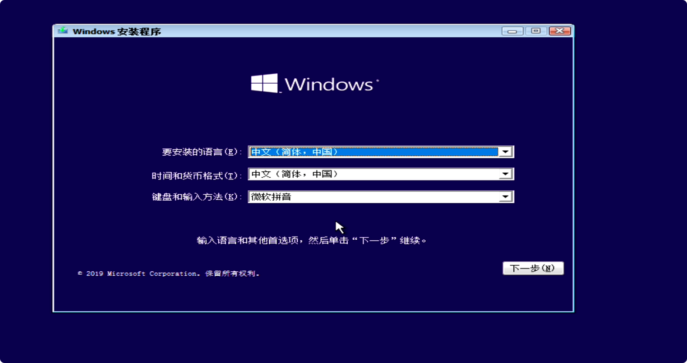

官方镜像安装好处：纯净 ，方便，简单

缺点：功能少，僵硬，只有给磁盘格式化分区之外，没有其他的功能，装系统本质上就是运行提前在U盘内放好的`windows`安装包

目前磁盘仅有的三种格式化方式

**FAT32**         **exFAT**        **NTFS**

`exFAT` `NTFS` 非常挑主板，老旧电脑和老旧主板可能会无法识别

`FAT32`没有兼容性问题，几乎所有设备都能用，但是单个分区最大体积不能超过32G，不能存放体积超过4G的文件

所以用 `FAT32` 的话硬盘本身的格式就僵硬了，而你用后两者没有这个问题，但是兼容性又成了问题，因此又衍生出来了另外一种安装系统的方法，使用`PE`便携式操作系统辅助进行安装 ， `PE`的优点是功能全且兼容性极广 

可依据自己的喜好来选择，这里先讲解如何使用命令行来操作安装官方的`ISO`镜像文件

安装前准备: 

一个正规的容量至少为 8G 的U盘

一个可以正常操作的电脑

一个聪明的大脑和一双灵巧的手

接下来就开始吧！

第一步，把U盘插到制作启动盘的电脑上，打开微软官网下载你要装对应的[win10](https://www.microsoft.com/zh-cn/software-download/windows10)或是[win11](https://go.microsoft.com/fwlink/?linkid=2171764)安装包（注意分辨清楚，不要进到第三方流氓网站上去了噢）:smirk:

第二步：点击运行下载的setup启动盘运行工具，稍等运作一下 :running:

选择为新电脑安装介质

选择系统语言，版本，对应的系统位数

选择对应使用的介质

U盘是直接把安装程序写入U盘内

`ISO`文件就是直接把镜像文件下载到本地电脑上

因为我们是要给新电脑安装系统，所以我们这里选择安装到U盘

点击下一步，接下来win10启动盘制作工具就会把我们的U盘格式化为`FAT32`格式，并将安装包写入进U盘内，需要一点时间，请耐心等待一会儿

写入完成之后，点击完成会清理系统缓存文件 

第一小阶段已经完成，系统启动盘制作完成

让我们打开U盘看看我们这半天在里面写入了一些什么文件

里面有一些win10的系统安装文件，我们U盘内肯定不会是只放系统的安装文件还有一些其他的学习资料，你可以选择新建一个文件夹并把它拖入进去，但是如果想正常安装系统的话就必须把这些文件放在根目录下，就会很麻烦，但是如果我们选择PE系统安装的话就不会有这样的问题

第二阶段 拔下U盘插入到需要安装系统的电脑上

按下开机键后不断点击`delete`按键直至电脑上出现`Bios`界面（各个型号电脑进入`Bios`界面会有不同，具体请自行百度或是查询电脑官网）

图例为华硕`Bios`界面

接下来我们需要修改第一启动项为U盘，因为U盘里面安装了我们下载的`windows`启动盘安装程序

右边的启动项菜单有三个

第一个为本机电脑的固态硬盘

第二个`UEFI`开头是我们插入电脑的金士顿U盘

第三个也是我们的金士顿U盘

既然有两个都是我们的U盘，那我们到底应该拖哪一个呢？ 	

这里就涉及到磁盘分区和启动引导之间的关系了

目前磁盘存储数据的格式有两种

一种是`MBR（Master Boot Record）`分区

一种是`GPT（GUID Partition Table）`分区，对没错就是平时问问题的人工智能的那个的`GPT`，比较新，比`MBR`要好

为什么呢？

1. **支持大容量硬盘**：GPT可以支持高达9.4ZB的硬盘，而MBR仅支持最大2TB。
2. **更多的分区数量**：GPT允许创建多达128个分区，无需像MBR那样仅限于4个主分区或通过扩展分区来增加分区数量。
3. **增强的数据完整性**：GPT提供循环冗余校验（CRC）检查，能够发现和修复分区表错误。它还在硬盘的两端各保存一份分区表，以提高数据恢复的可能性。
4. **更好的系统兼容性**：GPT与UEFI（统一可扩展固件接口）兼容，这是现代计算机的新标准，可以支持更安全的启动过程。
5. **适应现代技术**：GPT是为现代计算技术设计的，适用于所有现代操作系统，包括Windows、macOS和Linux。

系统在开机时需要`Bios`去引导才能正常打开，两种数据结构开机引导的方式也是不一样的，也有两种分别是`UEFI`和`legacy`

一些老旧主板不支持`UEFI`启动，只能选择`legacy`来引导，磁盘分区时就需要选择对应的`MBR`格式

所以那个下面没有`UEFI`的就是对应的`legacy`引导模式，既然`UEFI`比`legacy`要好，电脑主板也支持，那我们就选择把UEFI启动项退拖至第一位

之后我们点击保存并退出

之后电脑就会自动开始重启，这时我们就不要再按`delete`键了，不然又会进入到Bios界面

由于我们第一启动项选择的是U盘，而我们U盘有我们的`win10`安装程序，开机后就会来到`win10`安装程序的主界面

点击下一步开始安装，暂时先选择没有产品密钥，后续会使用`KMS`激活工具激活

选择对应版本，建议专业版  :full_moon_with_face:

 协议条款，管他呢，同意就完了，反正我也不看  :hugs:

选择安装类型为自定义

接下来进行磁盘分区，默认从c盘开始

上面三个分区是安装程序自动分出来的不要去动它，4的80G就是手动分出来的C盘（大小建议100G左右）

如果出现以下错误就是我们前面提到的我们的开机引导方式和磁盘分区格式不对应，所谓的驴唇不对马嘴

我们就需要切换磁盘分区格式

`shift+f10`打开命令提示符

输入`diskpart`    `list disk`  就会列出电脑里面所有的磁盘

磁盘0就是电脑本机的PM981固态硬盘

磁盘1就是我们的U盘

接下来输入 `select disk 0` 选中固态硬盘

`clean` 清空磁盘所有分区

`convert gpt` 切换为GPT分区格式（MBR同理）

输入两次exit就可以退出了  :last_quarter_moon_with_face:

点击刷新等待`win10`安装程序

接下来点击下一步，等待程序往磁盘内写入程序  :white_check_mark:

写入完成，接下来的十秒内你的电脑就会自动重启

重启时你的电脑的第一启动项应该是本机硬盘而不是U盘，大部分的主板会帮你自动切换，其实不拔U盘也不会有什么问题，但是为了防止主板犯傻，建议10s内拔掉U盘

之后你的电脑就会自动重启，这时候就什么都不要动，喝喝茶，耍耍手机，耐心等待  

开机后就会进入到win10初始化的主界面

接下来就是自己的一些个性化选项，自己按照需求选择即可

成功进入桌面，纯净版系统只有回收站和`edge`浏览器

添加此电脑到桌面 :happy:

右键选择  个性化 ---> 桌面图标设置 ---> 勾选计算机

这个时候我们的系统还没有激活，有些功能还不能使用这时候我们就需要下载[KMS激活工具](https://github.com/zbezj/HEU_KMS_Activator/releases/download/42.0.1/HEU_KMS_Activator_v42.0.1.rar)

[别急还有office三件套](https://otp.landian.vip/redirect/download.php?type=runtime&arch=x64&site=github)

至此，微软官方ISO镜像安装教程已经结束！
